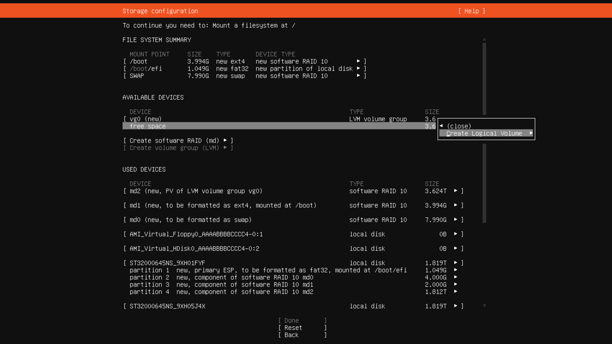
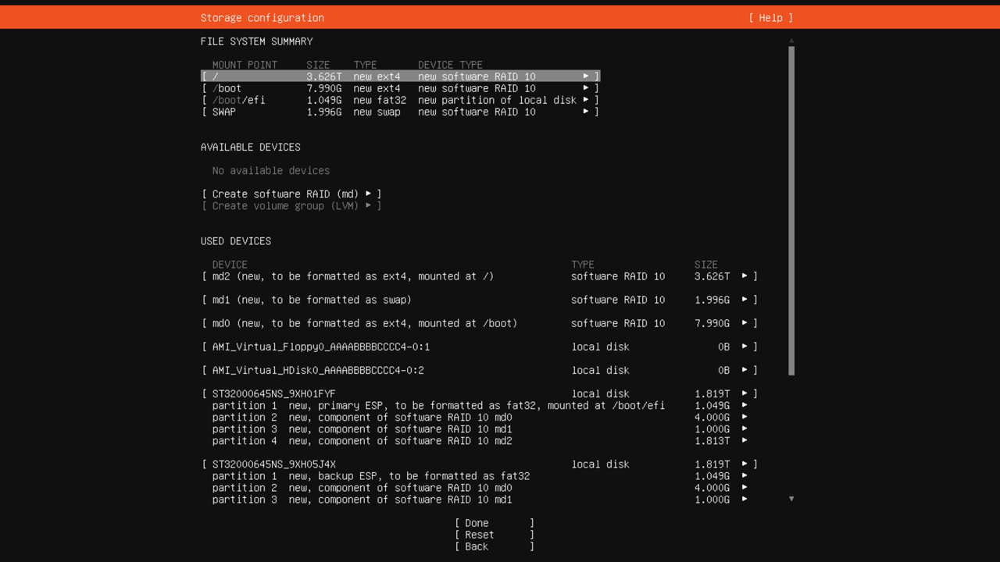
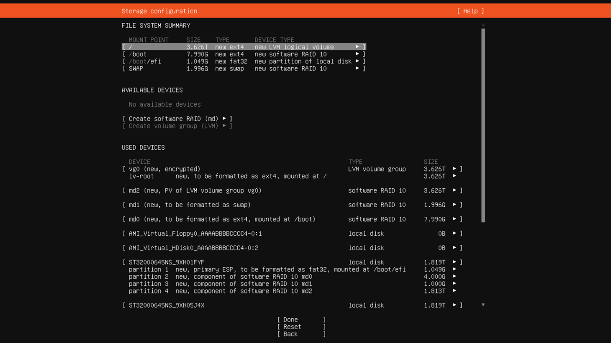
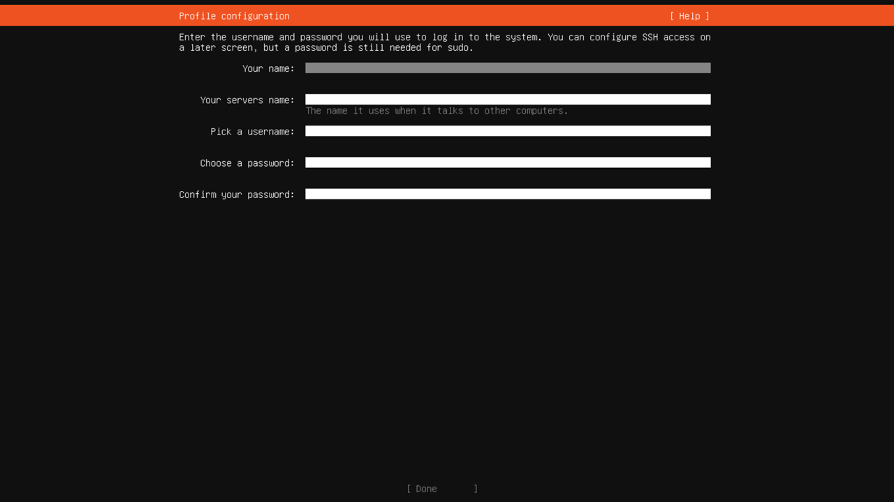

# Reinstalling an OS from a custom ISO image

{{ baremetal-full-name }} allows you to install and reinstall a server OS from a custom ISO image. This way, you can install [Linux](https://en.wikipedia.org/wiki/Linux) or [Windows](https://en.wikipedia.org/wiki/Microsoft_Windows) operating systems on your server. Note that if the OS you want to install requires a license, you must provide your own license.

When installing or reinstalling an OS from your ISO image, you can freely redistribute the available disk space on the server.

Creating fault-tolerant disk configurations requires experience and understanding of [RAID](https://en.wikipedia.org/wiki/RAID) and/or [LVM](https://en.wikipedia.org/wiki/Logical_Volume_Manager_(Linux)) technologies. We recommend using {{ marketplace-short-name }} public OS images instead, resorting to this installation method only if you need customizations beyond {{ marketplace-short-name }} options.

For example, you might need to install from your own ISO image if the required OS is not available in {{ marketplace-short-name }}, or you need a custom disk partitioning layout, [UEFI](https://en.wikipedia.org/wiki/UEFI)/SecureBoot mode, root encryption, or other options unavailable through {{ marketplace-short-name }} image deployment.



Incorrect disk partitioning or RAID configuration can lead to the loss of fault tolerance, unexpected partition space shortages, and server boot failures.



This guide demonstrates how to install [Ubuntu](https://en.wikipedia.org/wiki/Ubuntu_version_history) 24.04 in UEFI mode on a [BA-i201-H server](../../concepts/server-configurations.md) with four HDDs using a custom ISO image and [RAID10](https://en.wikipedia.org/wiki/Nested_RAID_levels#RAID_10) disk configuration with LVM.

## Boot the server from your custom ISO image in UEFI mode {#boot-from-image}

To create a {{ baremetal-name }} image from your ISO image and deploy it on the server:

1. [Download](https://releases.ubuntu.com/24.04.1/ubuntu-24.04.1-live-server-amd64.iso) the required ISO OS image to your local computer.
1. [Upload](../image-upload.md#upload-file) the ISO image to [{{ objstorage-full-name }}](../../../storage/index.yaml) and [create](../image-upload.md#create-image) a {{ baremetal-name }} image from it.
1. [Connect](./server-kvm.md) to the server's KVM console.

    

    All following steps will be performed in the KVM console.

    
1. Click the CD icon or select **Media** → **Virtual Media Wizard...** in the top menu of the KVM console window. In the window that opens:

    1. In the **CD/DVD Media1** section, click **Browse** and select the previously uploaded ISO OS image in the `user-iso` directory.
    1. Click **Connect CD/DVD**.
    1. Check the **Virtual CD 1** device **Status** section to make sure the **Connected To** field now shows your selected ISO path, then click **Close**.

    Depending on your server configuration, you may need to manually select the boot device or enable `UEFI` mode in [BIOS](https://en.wikipedia.org/wiki/BIOS). For instance, on a server with the `BA-i201-H` configuration, you must boot from a CD drive in UEFI mode for UEFI-based OS installations.
1. To boot the server from the selected ISO image:

    1. Click **Reboot to CD-ROM** in the top-right corner of the KVM console.
    1. During server boot, press **F11** or **Del** when the [POST](https://en.wikipedia.org/wiki/Power-on_self-test) screen appears. You will see the following message: `Entering Setup...`.
    1. Wait for the BIOS menu to appear, then use the **←** and **→** keys to navigate to the **Security** section.
    1. In the **Boot Override** section, use the **↑** and **↓** keys to select `UEFI: AMI Virtual CDROM0 1.00`, then press **Enter**.

        The server will restart and boot from the virtual CD drive in `UEFI` mode.

    

## Configure the basic OS settings {#basic-setup}

In this step, you will configure the basic settings for the OS installation. Perform all following actions in the KVM console:

1. In the [GRUB](https://en.wikipedia.org/wiki/GNU_GRUB) bootloader menu, select **Try or Install Ubuntu Server** and press **Enter**.
1. Select the system language:

    

    Use the **↑** and **↓** keys to navigate the menu.
1. Choose your keyboard layout, select **Done**, and press **Enter**. Depending on the selected layout, you may need to configure a keyboard shortcut for switching input languages.
1. Select the server installation option, either full or minimal:

    

1. Configure network interfaces. The default configuration uses [DHCP](https://en.wikipedia.org/wiki/Dynamic_Host_Configuration_Protocol) for all network interfaces:

    

1. If needed, configure a proxy and repository mirror address for OS package installation.

    For instance, you can use the following mirror address for Ubuntu systems: `http://mirror.yandex.ru/ubuntu`. In most cases, though, no configuration changes are needed.

1. Select the **Custom storage layout** disk partitioning option. To do this, navigate to this menu item and press **Space**.

    

    We recommended against using the default Ubuntu installer option of installing the system on a single drive. Such configuration is not fault tolerant, and the system disk failure will require at minimum a full OS reinstallation.

## Partition your disks and create RAID10 arrays {#setup-storage}



During disk partitioning, the created partitions will be automatically formatted. This operation will erase all existing data on the disks. Before you proceed, make sure you have backups of all important server files.



Proper disk partitioning is critical for OS installation, affecting disk subsystem performance, data storage reliability, server fault tolerance, and recovery speed in failure scenarios.

At this step, you can create any disk configuration, from basic {{ marketplace-short-name }} OS installer defaults to advanced LVM with encryption.

Before proceeding with OS installation, create the following partitions:

* `/`: Root partition.
* `/boot`: Boot partition.
* `swap`: Swap partition.
* `/home`: User home partition.
* `/srv`: Service data partition.
* `ESP`: `1` GB `UEFI` system partition.

    If you boot the server in `Legacy` mode, the system will create a `300` MB `BIOS grub spacer` system partition instead of the `ESP` partition.
    
    

    The `ESP` and `BIOS grub spacer` system partitions are created automatically when you select the disk as a primary or secondary boot device during installation.

    

To create a `RAID10` fault-tolerant disk array, you need at least four disks or partitions. If you plan to create a RAID array using disk partitions, first you need to prepare the disks by creating a partition table and defining equally sized partitions on each disk:

1. If the server has an OS installed and the disks already have partitions, remove all existing partitions. If the server was provisioned without an OS and you have not installed one yet, skip this step and proceed to the next one.

    1. In the **AVAILABLE DEVICES** section, remove all existing disk partitions and RAID arrays on the server.

        Use the **↑** and **↓** keys to select a partition or RAID, press **Enter**, then choose `DELETE` from the menu that appears and confirm the deletion.

        To delete all partitions on a disk, select the line containing this disk’s name, press **Enter**, then select `Reformat` and confirm the deletion.
    1. Repeat the previous step for all partitions, disks, and RAID arrays listed under **AVAILABLE DEVICES**.

        After completing these steps, the **AVAILABLE DEVICES** section should only show disks with unallocated space, e.g., `free space`:

        
1. Select your boot disks:

    1. Using the **↑** and **↓** keys, select any disk and press **Enter**.
    1. In the menu that appears on the right, select `Use As Boot Device` and press **Enter**.

        

        To install the bootloader, you must mark at least one disk as bootable. For fault tolerance, we recommend marking at least two disks.

    1. Select another disk, press **Enter**, and select `Add As Another Boot Device`.
1. Create matching partition layouts on all disks, sized according to the expected storage requirements. In this example, we will create three partitions on each disk:

    1. Partition the first disk:

        1. For the first disk in the list, select the **free space** entry, press **Enter**, then select `Add GPT Partition` from the menu that appears.
        1. In the **Size:** field of the dialog that appears, specify the size of the first partition: `4G`.
        1. In the **Format:** field, select `Leave unformatted`.
        1. Move the cursor to **Create** and press **Enter**.
        1. Repeat the process to create two additional partitions: one `2 GB` partition and the other using all remaining available space.
    1. Use the process described above to partition the remaining three disks. The partition layouts on all four disks must be the same.

    
1. Build RAID arrays using the partitions created in the previous step:

    1. Navigate to **Create software RAID (md)** in the menu and press **Enter**. In the dialog that opens:

        1. In the **RAID Level:** field, select `10`.
        1. Use the **Space** key to mark `4 GB` partitions on each disk.
        1. Move the cursor to **Create** and press **Enter**.

        

    1. Repeat the steps to create the second RAID `10` array using `2-GB` partitions and, finally, the third RAID `10` array using the remaining largest partitions.
1. Create filesystem partitions within your newly configured RAID arrays:

    1. Create the `swap` partition:

        1. Select the `md0` `8 GB` RAID array, press **Enter**, and select `Format` from the menu that appears.
        1. In the dialog that opens, select `swap` in the **Format:** field.
        1. Move the cursor to **Done** and press **Enter**.

    1. Create the `/boot` partition:

        1. Select the `md1` `4 GB` RAID array, press **Enter**, and select `Format` from the menu that appears.
        1. In the dialog that opens, leave the **Format** field set to `ext4` and select `/boot` in the **Mount:** field.
        1. Move the cursor to **Done** and press **Enter**.

        

1. Use the `md2` RAID array composed of your largest partitions to create a `vg0` LVM group:

    1. Create an LVM group:

        1. Navigate to **Create volume group (LVM)** in the menu and press **Enter**.
        1. In the dialog that opens, navigate to the `md2` array in the **Devices:** field and press **Space** to select it.
        1. Move the cursor to **Create** and press **Enter**.
    1. Create an `lv-root` logical volume for the root partition:

        

        1. In the `vg0` section under **AVAILABLE DEVICES**, select **free space** and press **Enter**, then select `Create Logical Volume` from the menu that opens.
        1. In the **Name:** field, specify `lv-root`.
        1. In the **Size:** field, specify the volume size as `100G`.
        1. Leave the **Format:** field set to `ext4` and the **Mount:** field set to `/`.
        1. Move the cursor to **Create** and press **Enter**.

        

    1. Repeat the steps to create the following logical volumes:
        * `lv-home`: `512 GB` logical volume mounted at `/home` for user directories.
        * `lv-srv`: `1 TB` logical volume mounted at `/srv` for service data.
    
        

    The remaining unallocated space in the `vg0` LVM volume group can be used to expand existing logical volumes or create additional volumes when needed. 

### Alternative disk partitioning options {#alternative-partitioning}

The disk partitioning scheme shown above is just an example. Disk partitioning should always be tailored to the projected server usage patterns. Furthermore, disk partitioning requirements differ between server boot modes: `Legacy` or `UEFI`.

Let’s consider some other disk partitioning configurations:



- Option 1

  Disk layout identical to that created by the {{ marketplace-short-name }} {{ baremetal-name }} installer in `Legacy` boot mode:

  

- Option 2

  Disk layout identical to that created by the {{ marketplace-short-name }} {{ baremetal-name }} installer in `UEFI` boot mode:

  

- Option 3

  Setting up partitioning with the root filesystem in the LVM logical volume, encrypted and hosted on a `RAID10` array:

  

  

  Partition encryption can have a number of downsides, such as reduced server performance, the need to enter an encryption key on every restart, and irreversible data loss if the key is lost. To avoid entering an encryption key on every boot, you can configure a [TPM](https://en.wikipedia.org/wiki/Trusted_Platform_Module) (Trusted Platform Module) on the server.

  



## Installing system files {#installation}

Once you completed disk partitioning on your server, you can proceed with system installation.



Up to this point, no disk modifications have been made yet, so you may safely abort the OS installation without data loss. Proceeding with installation will permanently erase all existing data on the target disks and physically create new partition structures.



1. To proceed, move the cursor to **Done** and press **Enter**.

    In the **Confirm destructive action** dialog that appears, click **Continue** to confirm disk formatting.
1. Specify the hostname, create the primary user account, configure SSH access if needed, and install additional software:

    

    Wait for the operating system installation to complete.

1. 
1. To boot into the new OS, select **Reboot Now** and press **Enter**:

    
1. Configure the server to boot in UEFI mode:

    1. While the server is booting, press **F11** or **Del** on the POST screen. You will see the following message: `Entering Setup...`.
    1. Wait for the system BIOS menu to appear, then navigate to the **Boot** section using the **←** and **→** keys.
    1. Select **1st Boot Device**, press **Enter**, and select `UEFI: Built-in EFI Shell`.
    1. Select **UEFI Boot Drive BBS Priorities** and press **Enter**. In the menu that opens, do the following:

        1. In the **1st Device** field, press **Enter** and select any of the `UEFI OS` values.
        1. Press **Esc** to return to the previous menu.
    1. Make sure the value of the **1st Boot Device** field has changed to `UEFI OS`.
    1. Navigate to the **Save & Exit** section, using the **←** and **→** keys.
    1. Select **Save Changes and Reset**, press **Enter**, and confirm the action by pressing **Yes**.

The server will now boot into the new operating system using UEFI mode.