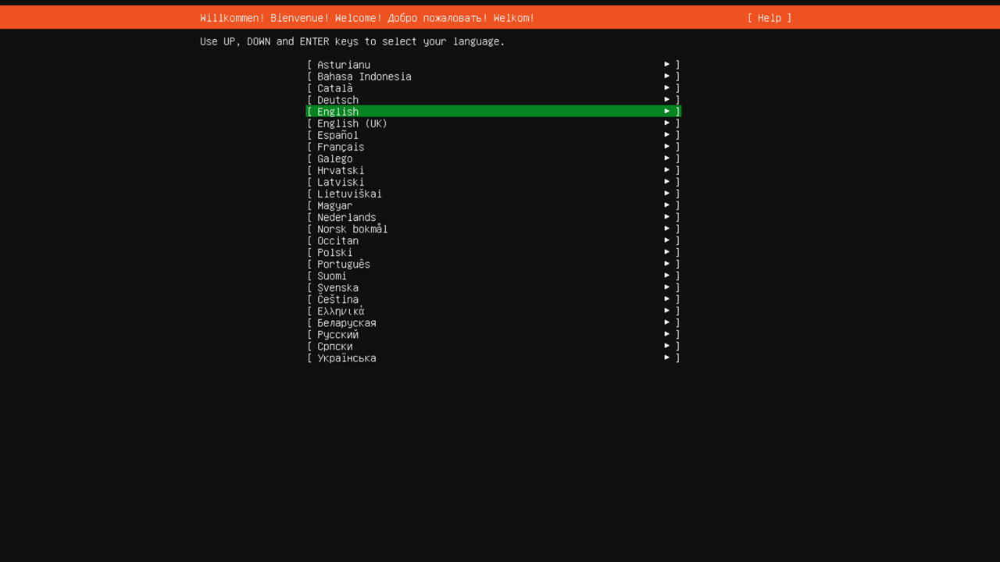
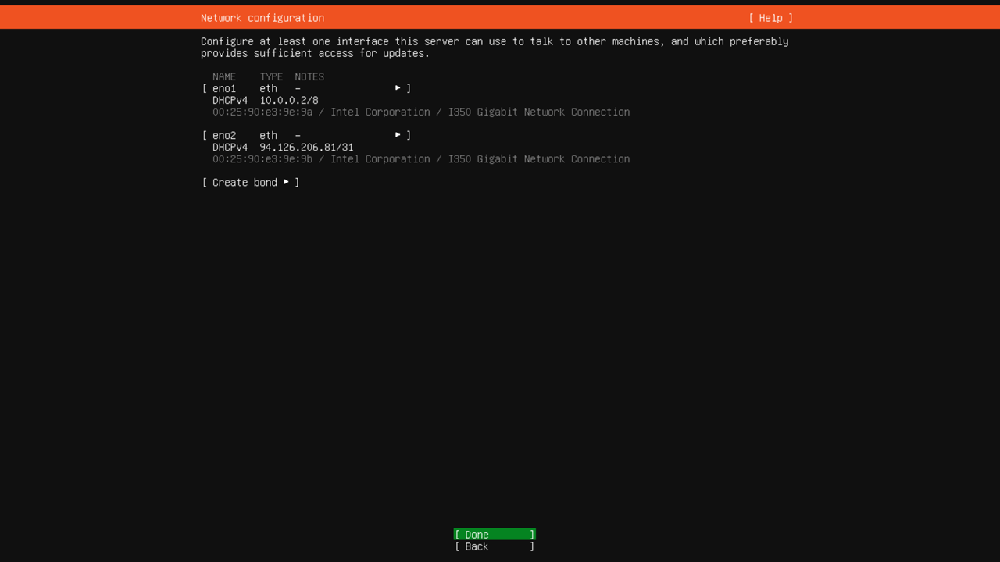
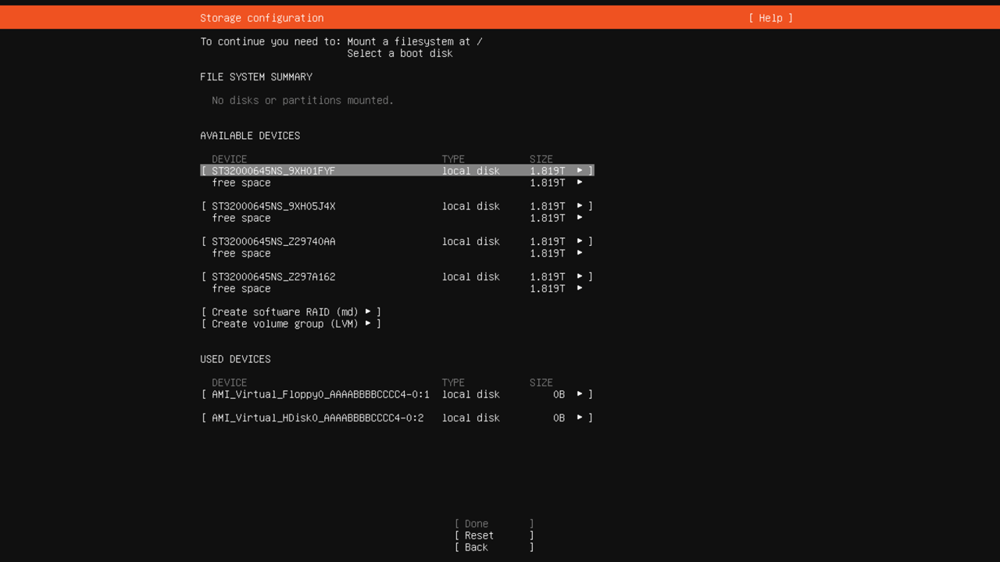
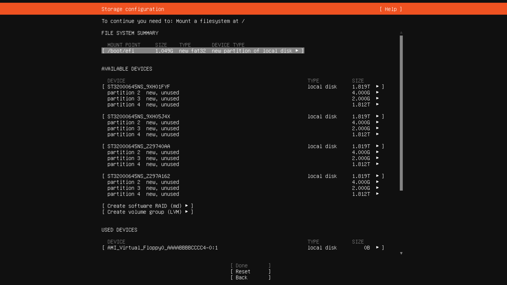
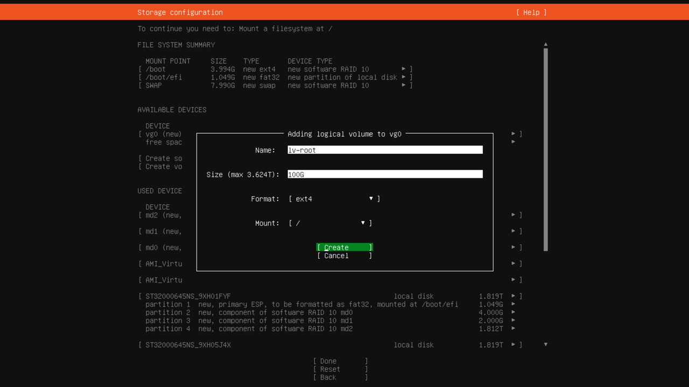

# Re-installing an OS from your ISO image

{{ baremetal-full-name }} allows users to install and re-install a server OS from their own ISO images. In this way, you can install [Linux](https://en.wikipedia.org/wiki/Linux) or [Windows](https://en.wikipedia.org/wiki/Microsoft_Windows) on a server. However, if the OS being installed requires a license, you must use your own one.

When installing or re-installing an OS from your ISO image, you can freely redistribute the disk space available on the server.

Fault-tolerant disk partitioning requires experience and understanding of [RAID](https://en.wikipedia.org/wiki/RAID) and/or [LVM](https://en.wikipedia.org/wiki/Logical_Volume_Manager_(Linux)) technologies, so we recommend opting for OS installation from a public [{{ marketplace-full-name }}](/marketplace) image and using the installation method in this tutorial only if you need to make significant changes that are not available when installing from {{ marketplace-name }}.

For example, you may need installation from your ISO image if the required OS is not available in {{ marketplace-name }}, or if you need a non-standard disk partitioning configuration, [UEFI](https://en.wikipedia.org/wiki/UEFI)/SecureBoot mode, root encryption, or other settings not available when installing from a {{ marketplace-name }} image.



Incorrect disk partitioning or RAID configuration can result in reduced or no fault tolerance, unexpected lack of free space on partitions, or inability to start the server.



This guide provides an example of installing [Ubuntu](https://en.wikipedia.org/wiki/Ubuntu_version_history) 24.04 in UEFI mode on a [BA-i201-H server](../../concepts/server-configurations.md) with four HDDs from your own ISO image in [RAID10] disk configuration (https://en.wikipedia.org/wiki/Nested_RAID_levels#RAID_10) with LVM.

## Run the server from your own ISO image in UEFI mode {#boot-from-image}

To create a {{ baremetal-name }} image from your ISO image and run the server from it:

1. [Download](https://releases.ubuntu.com/24.04.1/ubuntu-24.04.1-live-server-amd64.iso) the required OS image to your local computer.
1. [Upload](../image-upload.md#upload-file) the downloaded ISO image to [{{ objstorage-full-name }}](../../../storage/index.yaml) and [create](../image-upload.md#create-image) a {{ baremetal-name }} image from it.
1. [Connect](./server-kvm.md) to the server's KVM console.

    

    You will perform all further actions in the KVM console window.

    
1. In the KVM console window, in the top menu, select **Media** → **Virtual Media Wizard...** or click the CD icon. In the window that opens:

    1. In the **CD/DVD Media1** section, click **Browse** and select the previously uploaded ISO image of the OS in the `user-iso` directory.
    1. Click **Connect CD/DVD**.
    1. Check the **Status** section for the **Virtual CD 1** device to make sure the **Connected To** field now indicates the path to the ISO image you selected and click **Close**.

    Depending on the server settings, you may need to force selection of bootable media or `UEFI` mode in [BIOS](https://en.wikipedia.org/wiki/BIOS). For example, on a server with a `BA-i201-H` configuration, you must boot from a CD drive in UEFI mode to install an OS in UEFI mode.
1. To start a server from the selected ISO image:

    1. Click **Reboot to cdrom** in the top-right corner of the KVM console.
    1. While the server is loading, press **F11** or **Del** on the [POST](https://en.wikipedia.org/wiki/Power-on_self-test) screen. The following message will appear on the screen: `Entering Setup...`.
    1. Wait until the BIOS system menu opens and use the **←** and **→** keys to navigate to the **Security** section.
    1. Using the **↑** and **↓** keys, select `UEFI: AMI Virtual CDROM0 1.00` in the **Boot Override** section and press **Enter**.

        The server will restart again and boot from the virtual CD drive in `UEFI` mode.

    

## Configure the basic OS settings {#basic-setup}

At this stage, you will configure the basic settings for the OS being installed. Perform all the above actions in the KVM console terminal window:

1. In the [GRUB](https://en.wikipedia.org/wiki/GNU_GRUB) bootloader menu, select **Try or Install Ubuntu Server** and press **Enter**.
1. Select the system language:

    

    Navigate through the menu items using the **↑** and **↓** keys.
1. Select your keyboard layout, move the cursor to **Done**, and press **Enter**. Depending on the selected layout, you may need to set a keyboard shortcut to switch the input language.
1. Select the server installation option, either full or minimal:

    

1. Configure the network interface settings. By default, it is enough to leave [DHCP](https://en.wikipedia.org/wiki/Dynamic_Host_Configuration_Protocol) for all interfaces:

    

1. If required, configure a proxy and a mirror address for repositories to install OS packages.

    For example, when using Ubuntu, you can specify the following mirror address: `http://mirror.yandex.ru/ubuntu`. Usually, you do not have to make any edits.

1. Select the **Custom storage layout** option. To do this, move the cursor to this menu item and press **Space**.

    

    We do not recommended using the default option the Ubuntu installer offers, i.e., installing the system on a single drive. This option does not provide fault tolerance, and if the disk selected for system files fails, you will need to re-install the OS at the very least.

## Partition your disks and create the RAID10 arrays {#setup-storage}



When partitioning disks, the partitions will be formatted. This will result in the loss of all data stored on the disks. Before proceeding, make sure you have a backup of all important files stored on the server.



Disk partitioning is the most important stage of installing an OS. Disk subsystem performance, data storage reliability, server fault tolerance, and redundancy restoration speed in the event of failure all boil down to ensuring partitioning is correct and you selected the right partition configuration.

At this stage, you can create any disk configuration, from repeating the partitioning proposed when installing the OS from a {{ marketplace-name }} image to setting up LVM with encryption.

You will create the following partitions to continue installing the OS:

* `/`: OS кoot partition.
* `/boot`: Partition for the OS boot files.
* `swap`: Swap partition.
* `/home`: Partition for user home folders.
* `/srv`: Service data partition.
* `ESP`: `UEFI` system partition with a size of `1` GB.

    If you boot the server in `Legacy` mode, this will create a `BIOS grub spacer` system partition of `300` MB instead of the `ESP` partition.
    
    

    There is no need to manually create the `ESP` and `BIOS grub spacer` system partitions: they appear on the disk automatically when you select it as the primary or additional boot device.

    

To create a `RAID10`-level fault-tolerant disk array, you need at least four disks or disk partitions. RAID arrays are usually created from partitions of disk devices, so you first need to repartition all disks and create a partition table on each of them:

1. If the server already has an OS installed and the disks have already been partitioned, remove the current partitioning. If you rented the server without an operating system and have not installed the OS on it yet, skip this step and proceed to the next one.

    1. In the **AVAILABLE DEVICES** section, delete all disk partitions and RAID arrays on the server.

        To do this, use the **↑** and **↓** keys to select a partition or RAID, press **Enter**, select `DELETE` in the menu that appears, and confirm the deletion.

        To delete all partitions on the disk, move the cursor to the line with this disk’s name, press **Enter**, select `Reformat`, and confirm the deletion.
    1. Repeat the previous step for all partitions, disks, and RAID arrays displayed in the **AVAILABLE DEVICES** section.

        As a result, you should only have disk devices with unallocated disk space (`free space`) in the **AVAILABLE DEVICES** section:

        
1. Select your boot disks:

    1. Using the **↑** and **↓** keys, select any disk and press **Enter**.
    1. In the additional menu that appears on the right, select `Use As Boot Device` and press **Enter**.

        

        To install the bootloader, you must mark one disk as bootable, but to ensure fault tolerance, we recommend selecting at least two boot disks.

    1. Select another disk, press **Enter**, and select `Add As Another Boot Device`.
1. Create an identical set of partitions on each disk based on the expected disk space consumption. In this example, three separate partitions are created on the disks:

    1. Partition the first disk:

        1. Select the **free space** line of the first disk in the list, press **Enter**, and select `Add GPT Partition` in the additional menu that appears.
        1. In the form that opens, in the **Size:** field, set the size of the first partition to create: `4G`.
        1. In the **Format:** field, select `Leave unformatted`.
        1. Move the cursor to **Create** and press **Enter**.
        1. Repeat the previous steps to create two more partitions on the first disk: one `2 GB` in size, the other occupying all the space left after the first two partitions.
    1. Partition the remaining three server disks in the same way: the partition sizes on all four disks must match.

    
1. Build RAID arrays from the partitions created in the previous step:

    1. Move the cursor to the **Create software RAID (md)** menu item and press **Enter**. In the form that opens:

        1. In the **RAID Level:** field, select `10`.
        1. Use the **Space** key to mark `4 GB` partitions on all four disks.
        1. Move the cursor to **Create** and press **Enter**.

        

    1. Similarly, create a `10`-level RAID array of `2-GB` partitions and then, a `10`-level RAID array of the largest partitions.
1. Create partitions for the server file system in the RAID arrays you got:

    1. Create a `swap` partition:

        1. Move the cursor to the `md0` RAID array of `8 GB`, press **Enter**, and select `Format` from the menu that appears.
        1. In the form that opens, select `swap` in the **Format:** field.
        1. Move the cursor to **Done** and press **Enter**.

    1. Create a `/boot` partition:

        1. Move the cursor to the `md1` RAID array of `4 GB`, press **Enter**, and select `Format` from the menu that appears.
        1. In the form that opens, leave `ext4` in the **Format:** field; in the **Mount:** field, select `/boot`.
        1. Move the cursor to **Done** and press **Enter**.

        

1. From the `md2` RAID array built from the largest partitions, create a `vg0` LVM group:

    1. Create an LVM group:

        1. Move the cursor to the **Create volume group (LVM)** menu item and press **Enter**.
        1. In the form that opens, use **Space** to mark the `md2` array in the **Devices:** field.
        1. Move the cursor to **Create** and press **Enter**.
    1. Create an `lv-root` logical volume for the root partition:

        

        1. Under **AVAILABLE DEVICES**, in the section with the `vg0` device, move the cursor to the **free space** line, press **Enter**, and select `Create Logical Volume` in the menu that opens.
        1. In the **Name:** field, enter `lv-root`.
        1. In the **Size:** field, set the volume size to `100G`.
        1. In the **Format:** field, leave the `ext4` value; in the **Mount:** field, leave the `/` value.
        1. Move the cursor to **Create** and press **Enter**.

        

    1. Create logical volumes in the same way:
        * `lv-home`, `512 GB` in size with a `/home` mount point for user home folders.
        * `lv-srv`, `1 TB` in size with an `/srv` mount point for service data.
    
        

    You can use the space left unallocated in the `vg0` LVM group to expand existing logical volumes or create new ones later. 

### Alternative disk partitioning options {#alternative-partitioning}

The above disk partitioning is an example. In each case, you need to partition disk space based on the projected usage scenarios for the server. In addition, disk partitioning will vary depending on the boot mode set on the server: `Legacy` or `UEFI`.

Here are some other possible server disk partitioning configurations:



- Option 1

  Partitioning similar to that created by the {{ baremetal-name }} installer from the {{ marketplace-name }} image (`Legacy` boot mode):

  

- Option 2

  Partitioning similar to that created by the {{ baremetal-name }} installer from the {{ marketplace-name }} image (`UEFI` boot mode):

  

- Option 3

  Partitioning with the root partition in an LVM group with encryption created in the `RAID10` array:

  

  

  Partition encryption can have a number of downsides, such as reduced server performance, the need to enter the encryption key at each restart (or having a correctly configured [TPM](https://en.wikipedia.org/wiki/Trusted_Platform_Module) module in the server), and irreversible data loss if the key is lost.

  



## Installing system files {#installation}

Once you have created the required disk partitioning on your server, you can start installing the system files.



Up to this point, you have not yet physically made any changes to the server's disk structure, and you can cancel the OS installation process without losses. Continuing the installation will result in the deletion of all data on the disks and the physical creation of new partitions.



1. To continue the installation, move the cursor to **Done** and press **Enter**.

    In the **Confirm destructive action** form that appears, click **Continue** to confirm your consent to format the disks.
1. Set the hostname, create the first user, configure SSH if required, and install additional software:

    

    Wait for the installation of the OS files on the server to complete.

1. 
1. To restart the server to the new OS, move the cursor to **Reboot Now** and press **Enter**:

    
1. Configure the server to boot in UEFI mode:

    1. While the server is booting, press **F11** or **Del** on the POST screen. The following message will appear on the screen: `Entering Setup...`.
    1. Wait until the BIOS system menu opens and use the **←** and **→** keys to navigate to the **Boot** section.
    1. Select **1st Boot Device**, press **Enter**, and select `UEFI: Built-in EFI Shell`.
    1. Select **UEFI Boot Drive BBS Priorities** and press **Enter**. In the menu that opens:

        1. In the **1st Device** field, press **Enter** and select any of the `UEFI OS` fields.
        1. Press **Esc** to return to the previous menu.
    1. Make sure the value in the **1st Boot Device** field has changed to `UEFI OS`.
    1. Use the **←** and **→** keys to navigate to the **Save & Exit** section.
    1. Select **Save Changes and Reset**, press **Enter**, and confirm the action by pressing **Yes**.

As a result, the server will boot into the new OS in UEFI mode.