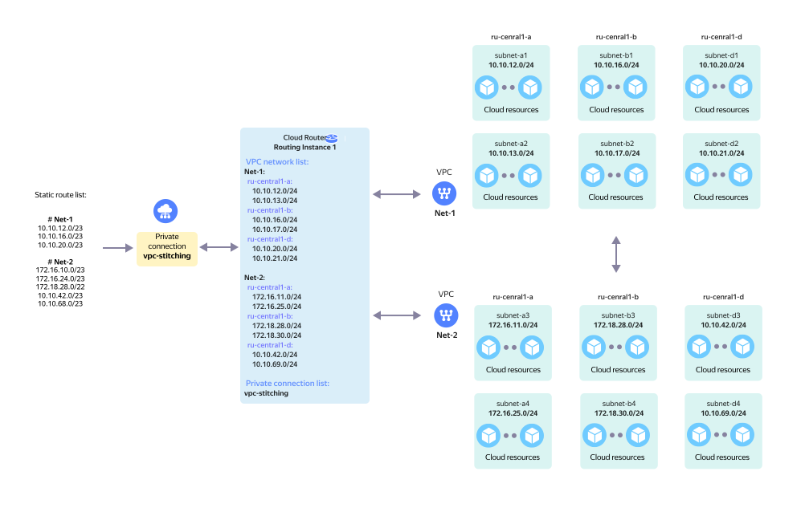

# Establishing network connectivity between two or more cloud networks (VPC Stitching)



The network topology is presented on the diagram in the following configuration:

* From the Yandex Cloud side, the `Routing Instance` is connected to by virtual network `Net-1` comprised of six subnets: `subnet-a1`, `subnet-a2`, `subnet-b1`, `subnet-b2`, `subnet-d1`, and `subnet-d2`. The information about the subnets' IP prefixes is added to `RI`.

* From the Yandex Cloud side, the `Routing Instance` is connected to by virtual network `Net-2` comprised of six subnets: `subnet-a3`, `subnet-a4`, `subnet-b3`, `subnet-b4`, `subnet-d3`, and `subnet-d4`. The information about the subnets' IP prefixes is added to `RI`.

* For network connectivity between virtual networks `Net-1` and `Net-2`, a special private `vpc-stitching` connection is created in the `Routing Instance`. This private connection terminates on Yandex Cloud network equipment.

* To achieve network connectivity between virtual networks `Net-1` and `Net-2` for the `vpc-stitching` private connection, you need to configure [stitching announcements](../concepts/vpc-stitching.md) for the CIDRs of the corresponding subnets in virtual networks `Net-1` and `Net-2`.



Virtual network subnets' own prefixes cannot be used as stitching announcements.



