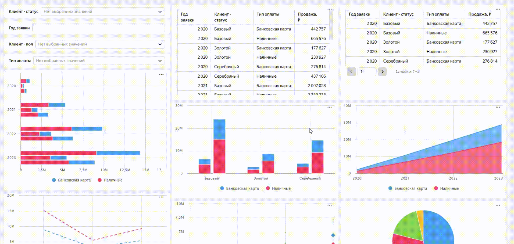
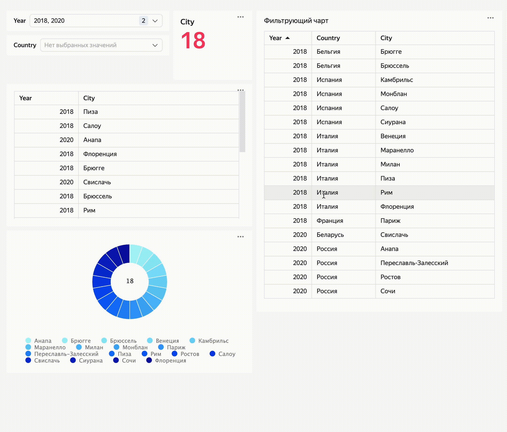

# Cross-filtering



Filtering parameters are used to filter charts by charts. In this case, some chart acts as a selector for other charts.

When a filtering chart is opened from a dashboard for edits or in a new tab, the filter parameters are highlighted.

By default, when opening a filtering chart from the navigation panel, no filters apply. For debugging, you can add the reserved `_action_params=1` parameter to the page `url`.

* Using the chart to filter other charts:

  

* Using the table to filter other charts:

  

#### Example {#example}

* [Filtering for Table](https://datalens.yandex/nvkfwnekf9xy9?tab=Ow#Таблица)

* [Filtering for Chart (Gravity UI Charts)](https://datalens.yandex/nvkfwnekf9xy9?tab=Ow#График%20Gravity%20Сharts)

* [Filtering for Advanced chart](https://datalens.yandex/nvkfwnekf9xy9?tab=Ow#Advanced%20чарт)
