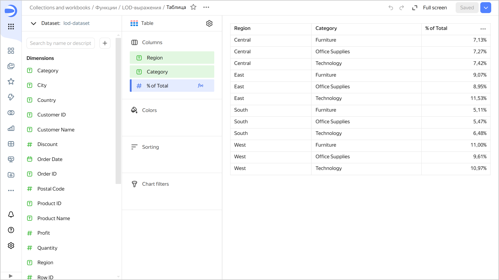
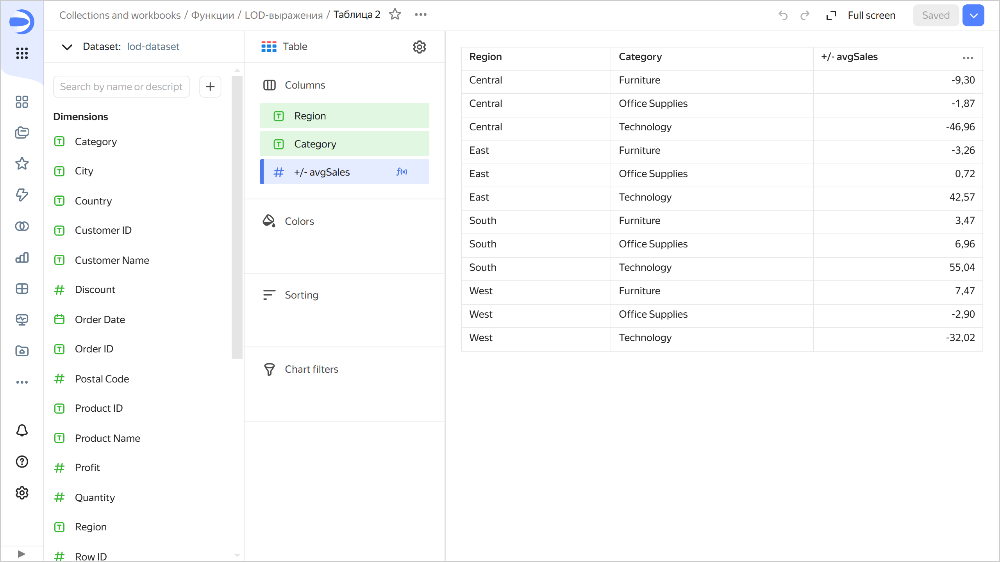

# LOD expressions and filtering in aggregation functions

By default, in {{ datalens-short-name }}, [aggregate functions](../function-ref/aggregation-functions.md) are calculated with grouping by the dimensions involved in the chart building (i.e., located in one of the chart sections). You can change the grouping for an aggregate function if you specify the [level of detail](../function-ref/aggregation-functions.md#syntax-lod). By managing it, you can add or exclude dimensions from grouping and use nested aggregations. For more information about how data aggregation and groupings work in {{ datalens-short-name }}, see [{#T}](aggregation-tutorial.md).

As a data source, we will use a direct [connection](../tutorials/data-from-ch-to-sql-chart.md#create-connection) to a demo database; the dataset is based on the `SampleSuperstore` table.

## Grouping in LOD expressions {#lod-grouping}

Use the following keywords to specify the level of detail in LOD expressions (see [this section](../function-ref/aggregation-functions.md#syntax)):

* [FIXED](#fixed)
* [INCLUDE](#include)
* [EXCLUDE](#exclude)

Keywords override the grouping set in the chart when calculating a specific aggregate function.



You can use dimensions in LOD expressions whether they are used in the chart or not. However, the top-level aggregation should only contain dimensions that are used in the chart (i.e., located in one of its sections).



### FIXED {#fixed}

The `FIXED` keyword allows grouping based on explicitly listed dimensions. If you use `FIXED` without a list of dimensions, all data will be aggregated into a single group.

**Example 1**

In a chart grouped by `Region` and `Category`, we need to calculate the percent of total sales for each category in the region (`% of Total`). 

Let's create a measure calculated as `SUM([Sales]) / SUM([Sales] FIXED)`, where:

* `SUM([Sales])`: Sales per category in the city (uses the chart's default grouping). 
* `SUM([Sales] FIXED)`: Total sales (uses grouping without dimensions).

For the **Table** chart, the result will look like this:



**Example 2**

For each product category in the same chart, we are going to calculate how much the region's average sales deviate from average sales across all regions (`+/- avgSales`).

Let's create a `AVG([Sales]) - AVG([Sales] FIXED [Category])` measure, where:

* `AVG([Sales])`: Region's average sales by category (uses the chart's default grouping by the `[Region]` and `[Category]` dimensions). 
* `AVG([Sales] FIXED [Category])`: Average sales by category across all regions (uses grouping by the `[Category]` dimension).

For the **Table 2** chart, the result will look like this:



### INCLUDE {#include}

Use the `INCLUDE` keyword to add specified dimensions to the chart grouping. As a result, the level of detail will be greater when calculating the aggregate function.
Expressions with `INCLUDE` can be useful if you need to calculate a measure with a higher level of detail but present it less detailed in the chart. For example, you can calculate daily sales and then do the averaging.

If used with an empty list of dimensions, `INCLUDE` results in the same grouping as in the chart.

**Example 1**

Let's calculate the maximum number of orders by region per date. We will use nested aggregation: first, we will count the number of orders per date, and then select the maximum value. Measure calculation formula: `MAX(COUNTD([Order ID] INCLUDE [Region]))`.



In this example, the `[Region]` dimension, which is missing in the chart, is added on the nested level. The top-level aggregation will thus be calculated grouped by the chart's `[Order Date]` dimension, and the nested aggregation will use grouping by the `[Order Date]` and `[Region]` dimensions.



For the **Line chart**, the result will look like this:


The chart uses only one dimension, `[Order Date]`. The order count is calculated with grouping by date and region because the `[Region]` dimension is added to the grouping for the [COUNTD](../function-ref/COUNTD.md) function.

**Example 2**

Let's calculate the number of customers with an average purchase amount over 1,000 for each product subcategory. To do this, we will create a measure using the [COUNTD_IF](../function-ref/COUNTD_IF.md) function. The formula for the measure is `COUNTD_IF(ANY([Customer ID] INCLUDE [Customer ID]), AVG([Sales] INCLUDE [Customer ID]) > 1000)`, where:

* `ANY([Customer ID] INCLUDE [Customer ID])`: The `[Customer ID]` dimension is converted into a measure with the help of the [ANY](../function-ref/ANY.md) function.
* `AVG([Sales] INCLUDE [Customer ID]) > 1000`: Average purchase amount is compared to the specified value.

For the **Column chart**, the result will look like this:


Any `INCLUDE`-based aggregation can be replaced with a `FIXED`-based one. For example, in a chart grouped by the `Region` and `Category` dimensions, the `SUM(SUM([Sales] INCLUDE [City]))` measure will be the same as `SUM(SUM([Sales] FIXED [Region],[Category],[City]))`.

### EXCLUDE {#exclude}

Use the `EXCLUDE` keyword to exclude specified dimensions from the chart grouping. As a result, the value of the aggregate function is calculated with grouping by all dimensions of the chart, except those listed.

For example, `EXCLUDE` expressions can be used to calculate the percentage of the total number or the difference from the total average.

If used with an empty list of dimensions, `EXCLUDE` results in the same grouping as in the chart.

**Example 1**

Let's calculate sales for regions broken down by delivery type. First off, we are going to set the chart up to use grouping by `[Region]` and `[Ship Mode]`. To get total sales across all delivery types, we are going to add the following measure to the **Signatures** section: `IF([Ship Mode]="First Class", SUM([Sales] EXCLUDE [Ship Mode]), NULL)`. With `EXCLUDE`, the `[Ship Mode]` dimension is excluded from grouping when calculating this measure, so that total sales across all delivery types can be calculated.

For the **Bar chart**, the result will look like this:


**Example 2**

Let's calculate average daily sales, broken down by month. First, let's add grouping by month to the chart: set the `[Order Date]` field in the **Grouping** setting to **Rounding** ⟶ **Month** (for more information, see [{#T}](chart/settings.md#field-settings)). Proceed to create a measure with the `AVG(SUM([Sales] FIXED [Order Date]) EXCLUDE [Order Date])` formula, where:

* `SUM([Sales] FIXED [Order Date])`: Total sales under all orders per day.
* `AVG(SUM([Sales] FIXED [Order Date]) EXCLUDE [Order Date])`: The `[Order Date]` dimension is excluded from the grouping to calculate average daily sales with grouping by month (as set in the chart).

For the **Bar chart**, the result will look like this:


Any `EXCLUDE`-based aggregation can be replaced with a `FIXED`-based one. For example, in a chart grouped by the `Region` and `Category` dimensions, the `SUM([Sales] EXCLUDE [Category])` measure will be the same as `SUM([Sales] FIXED [Region])`.

## Filtering {#before-filter-by}

The [BEFORE FILTER BY](window-function-tutorial.md#before-filter-by) section in LOD expressions has the same meaning as in window functions: the aggregate function is calculated before filtering by the specified fields.

**Example**

Let's compare the measures of average daily sales per month for a certain year with those for the entire period. First, we will add two new dimensions to the chart, the month and the year of the order:

* Month: `MONTH([Order Date])`
* Year: `YEAR([Order Date])`

We are going to create two measures to calculate the sales value:

* AvgDaySales: `AVG(SUM([Sales] FIXED [Order Date]) EXCLUDE [Order Date] BEFORE FILTER BY [Year])`
* AvgDaySales by year: `AVG(SUM([Sales] FIXED [Order Date]) EXCLUDE [Order Date])`

Let's now add the `Year` dimension to the **Filters** section and set it, for example, to `2017`. As a result, the `AvgDaySales` measure will be calculated before the chart is filtered by year, so we will get average daily sales per month for the whole period. The `AvgDaySales by year` measure will be calculated after the chart is filtered by year, so we will get average daily sales per month for the selected year (`2017`).

For the **Line chart**, the result will look like this:


## Common features with window functions {#lod-and-window}

In some cases, LOD expressions can be used as an alternative to [window functions](../function-ref/window-functions.md).

For example, a `FIXED` expression with a list of dimensions can be used the same way as a window function with [WITHIN](window-function-tutorial.md#within) grouping, whereas an `EXCLUDE` expression, the same way as a window function with [AMONG](window-function-tutorial.md#among) grouping.

**Example 1**

Let's have a look at the chart, which calculates the percentage of each product category from the total sales per city. The `% Total by city window` and `% Total by city lod` measures yield the same result:

* % Total by city lod: `SUM([Sales]) / SUM([Sales] FIXED [City])`
* % Total by city window: `SUM([Sales]) / SUM(SUM([Sales]) WITHIN [City])`

In some cases, `FIXED` with an empty list of dimensions is the same as a window function with [TOTAL](window-function-tutorial.md#one-window-grouping) grouping (which in turn is synonymous to `WITHIN` with an empty list).

**Example 2**

Let's have a look at the chart, which calculates the percentage of each product category from the total sales across all cities. The `% Total window` and `% Total lod` measures yield the same result:

* % Total lod: `SUM([Sales]) / SUM([Sales] FIXED)`
* % Total window: `SUM([Sales]) / SUM(SUM([Sales]) TOTAL)`

For `INCLUDE`, there is no equivalent in window functions: you cannot add new dimensions there.

## Limitations {#restrictions}

Certain limitations apply when it comes to the level of detail in LOD expressions:

1. Top-level aggregations cannot contain dimensions that are not used in the chart. Therefore, you cannot use a top-level aggregation with a non-empty `INCLUDE` or `FIXED` containing dimensions not used in the chart.

   **Example**

   Let's create a measure to calculate average sales per city in a chart grouped by the `[Region]` and `[Category]` dimensions:

   

   - Correct
  
     ```
     AVG(AVG([Sales] INCLUDE [City]))
     ```

     In this case, the nested aggregation will be grouped by dimensions [inherited](../function-ref/aggregation-functions.md#syntax-lod-inheritance) from the top-level aggregation (`[Region]` and `[Category]`) plus the `[City]` dimension added to the grouping with the help of `INCLUDE`. The top-level aggregation will thus be calculated, grouped by the chart's `[Region]` and `[Category]` dimensions, and the nested aggregation will use grouping by the `[Region]`, `[Category]`, and `[City]` dimensions.

   - Incorrect
  
     ```
     AVG([Sales] INCLUDE [City])
     ```

     When calculating this measure, the top-level grouping is done based on the `[Region]`, `[Category]`, and `[City]` dimensions. In this case, the error occurs because the chart does not use the `[City]` dimension, which was added to the grouping with the help of `INCLUDE`.

   

1. Aggregations that are at the same nesting level cannot have different dimensions. At least one of the nested aggregations must contain all dimensions present in other nested aggregations.

   **Example**

   Let's create a measure to calculate the city with the maximum average daily sales in a chart grouped by the `[Region]` and `[Category]` dimensions:

   

   - Correct

     ```
     ARG_MAX(
          ANY([City] INCLUDE [City]),
          AVG([Sales] INCLUDE [City],[Order Date])
     )
     ```

     The `ANY([City] INCLUDE [City])` and `AVG([Sales] INCLUDE [City],[Order Date])` aggregations are at the same nesting level (inside `ARG_MAX`). The second aggregation contains all dimensions by which the first aggregation is grouped.

   - Incorrect

     ```
     ARG_MAX(
          ANY([City] INCLUDE [City]),
          AVG([Sales] INCLUDE [Order Date])
     )
     ```

     The `ANY([City] INCLUDE [City])` and `AVG([Sales] INCLUDE [Order Date])` aggregations are at the same nesting level (inside `ARG_MAX`). The first aggregation has the `[City]` dimension; the second one, `[Order Date]`. At the same time, there is no other aggregation that has both dimensions.

   

1. You cannot use aggregations with a certain level of detail and the [AGO](../function-ref/AGO.md) and [AT_DATE](../function-ref/AT_DATE.md) functions in the same query (in the same chart or in the dataset preview), even if they are in different fields.
