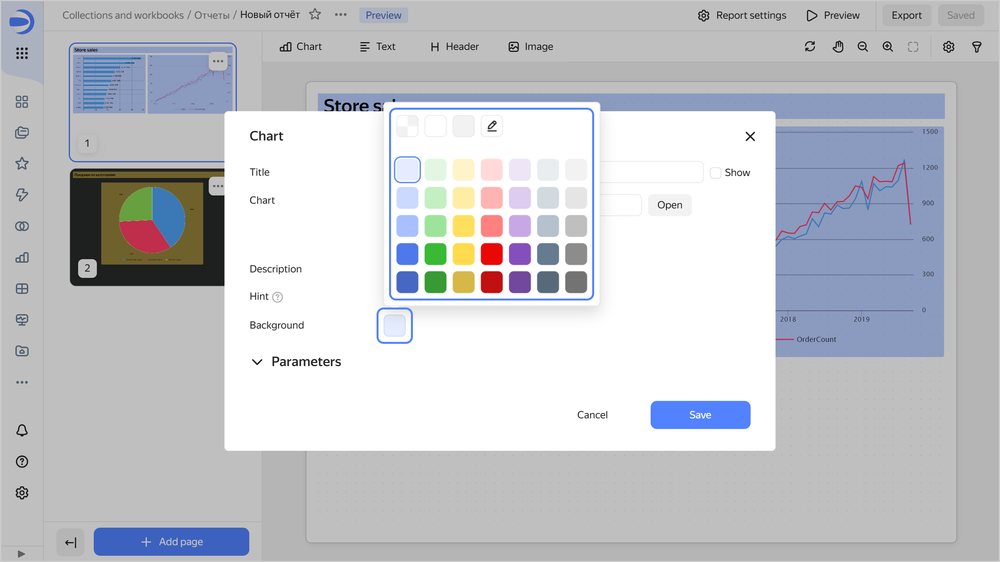
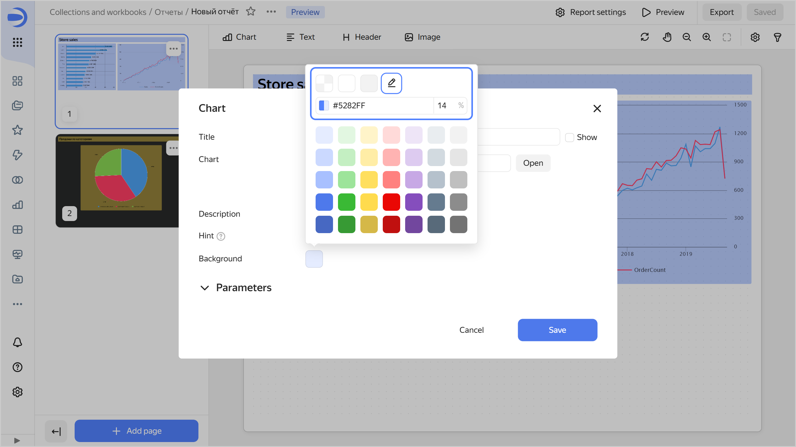
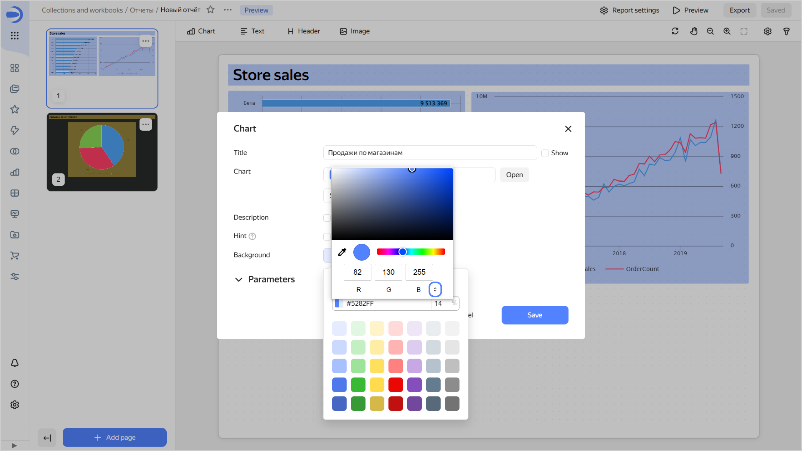
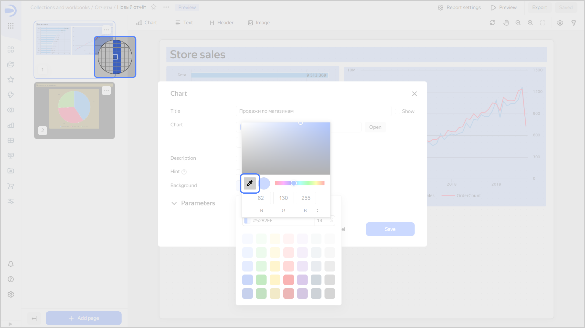
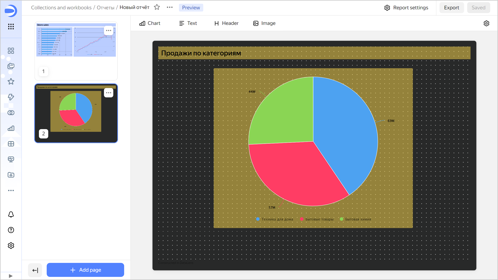
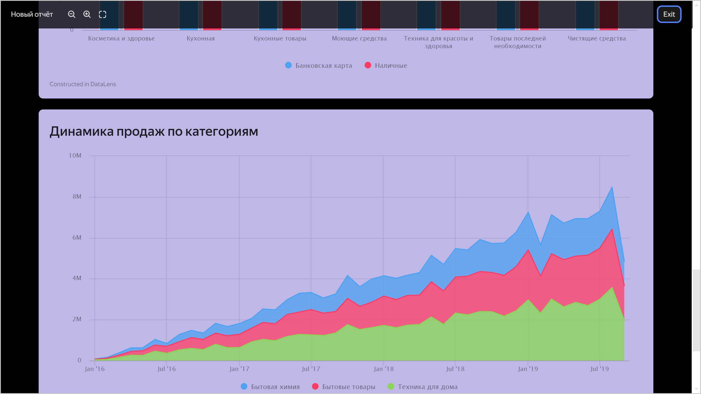
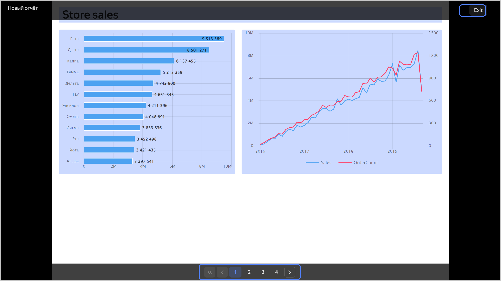

# Working with a report



In this section, you will learn how to work with a report:

* [Creating a report](#create-report)
* [Adding, moving, or deleting pages](#report-pages)
* [Configuring widgets](#report-widget-settings)
* [Configuring a report](#report-settings)
* [Configuring selectors](#add-selector)
* [Configuring pages](#page-settings)
* [Sharing a link to a report](#link-on-report)
* [Configuring scaling](#scaling-settings)
* [Enabling preview](#report-preview)
* [Exporting a report](#report-export)

## Creating a report {#create-report}

There is a number of ways to create a report:



- Workbook

  1. Go to the [page with workbooks and collections]({{ link-datalens-main }}/collections).
  1. Open the [workbook](../workbooks-collections/index.md) to create a report in.
  1. In the top-right corner, click **Create** and select **Report**.
  1. [Add pages](#report-pages) to your report.
  1. [Add](#add-widget) the required [widgets](../dashboard/widget.md) to the pages.
  1. [Configure your report](#report-settings) and its individual [pages](#page-settings).
  1. In the top-right corner, click **Save**.
  1. In the window that opens, enter a name for the report and click **Create**.

- Navigation bar

  1. Go to the {{ datalens-short-name }} [home page]({{ link-datalens-main }}).
  1. In the left-hand panel, select  **Reports** and click **Create report**.
  1. [Add pages](#report-pages) to your report.
  1. [Add](#add-widget) the required [widgets](../dashboard/widget.md) to the pages.
  1. [Configure your report](#report-settings) and its individual [pages](#page-settings).
  1. In the top-right corner, click **Save**.
  1. In the window that opens, enter a name for the report and click **Create**.



You can [export](#report-export) the report you created.

## Adding, moving, or deleting pages {#report-pages}

You can add multiple pages to a report, reorder, or delete them:

* To add a page, click  **Add Page** at the bottom left.
* To duplicate a page, click the  icon next to the page in the preview area and select  **Duplicate**.
* To change the order of pages, drag them to a new location using your mouse.
* To delete a page, in the preview area, click the  icon next the page and select  **Delete**.

## Configuring widgets {#report-widget-settings}

You can add, copy, or delete widgets in your report. If your widgets overlap, you can move them to the foreground or background.

### Adding a widget {#add-widget}

1. Select the report page you want to add the widget to.
1. Select a widget: [Chart](../concepts/chart/index.md), [Text](../dashboard/widget.md#text), [Title](../dashboard/widget.md#title), or Image. To properly position your widget right away, drag it with the left mouse button held down.
1. Configure your widget:

   

   - Image {#image}

     * Add a link to an [image](../dashboard/markdown.md#image) from a [{{ objstorage-full-name }}](../../storage/quickstart.md) storage.

       

       In {{ objstorage-full-name }}, you must configure the [CORS](../../storage/operations/buckets/cors.md) settings for the bucket with the image:

       

       

     * Optionally, specify an alternative text to display if the image fails to load.
     * Optionally, disable maintaining the aspect ratio when resizing the widget. This option is enabled by default.
     * Optionally, set a [background for your widget](#widget-background).

   - Chart {#chart}

     * **Name**: Widget name. If the **Show** option is enabled (default), the name is displayed at the top of the widget.
     * **Chart**: Select a chart from the list of items or provide a link to your chart.
     * (Optional) **Description**: Text displayed at the bottom of the widget.
     * Optionally, under **Parameters**, list [chart parameters](../dashboard/dashboard_parameters.md#params-chart) and set their default values. If no default values are set, the report will display an error.
     * Optionally, set a [background for your widget](#widget-background).

     To start editing the chart, click  next to the widget and select  **Edit**.

   - Text {#text}

     * Enter the text of your link, clarifying caption, etc. The widget supports the [Markdown](../dashboard/markdown.md) markup language.

       

       If inserting an image from a {{ objstorage-full-name }} storage into your widget, configure the [CORS](../../storage/operations/buckets/cors.md) settings for the bucket containing the image:

       

       

     * Optionally, set a [background for your widget](#widget-background).

   - Title {#header}

     * Enter title text.
     * Select the size from the preset ones: `XS`, `S`, `M`, `L`, and `XL`. Alternatively, click  and specify the font size in pixels.
     * Optionally, set a [background for your widget](#widget-background).

   

1. Click **Add**.
1. Resize the widget and drag it to a convenient location on the page. You can also move the selected widget up, down, or sideways with arrow keys. Here is how you can do this:

   * Arrow keys to move by one pixel.
   * **Shift** + arrow keys to move by ten pixels.

1. In the top-right corner, click **Save**.

You can copy and paste an existing widget onto the page:

* From any page of the current report.
* From the page of another report in the same workbook.
* From any dashboard in the same workbook.

To insert a copied widget onto a page:

1. Click the  icon next to the widget you want to copy and select  **Copy**. You can copy a widget from a dashboard in edit mode.
1. Select the report page you want to insert the widget onto.
1. On the widget panel at the top, click  **Insert**.
1. Resize the widget and move it to a convenient location on the page.
1. In the top-right corner, click **Save**.

You cannot copy an [image](../dashboard/markdown.md#image) from a report to a dashboard.

### Deleting a widget {#delete-widget}

1. Select the report page the widget is on.
1. Click the  icon next to the widget and select  **Delete**.
1. In the top-right corner, click **Save**.

### Moving a widget to the foreground or background {#move-widget-front-or-back}

Widgets are arranged in layers overlapping each other. You can set the order of widgets on the page manually:

1. Select the report page the widget is on.
1. Click the  icon next to the widget and select:

   *  **Foreground** to move the widget to the foreground.
   *  **Background** to move the widget to the background.

1. In the top-right corner, click **Save**.

When you select or move a widget around the page, it is automatically overlaid on top of other widgets. As soon as you stop interacting with the widget, it returns to its layer.

### Configuring a widget background {#widget-background}

To configure your widget's background, do the following:

1. Click the button holding the current background color, next to the setting.
1. Set the background in one of the following ways:

   * Select a color of those available as part of color palette options.

     

     

     

   * Click  and set a color in hex format. Also, you can specify the background transparency as a percentage value.

     

     

     

   * Click . Click the color icon preceding its hex value. In the window that opens, select a color from the color palette or specify a color in RGB, HSL, or hex format. To switch between formats, click .

     

     

     
     
     You can also use the color picker (eyedropper) tool to select a color on the report page.

     

     

     

## Configuring a report {#report-settings}

Report settings are valid for all its pages:

1. At the top right, click  **Report settings**.
1. Customize the appearance:

   * **Theme**: Select a page design theme,  light or  dark.
   * **Contrast**: Select standard (default) or high contrast.
   * **Background color**: Specify a color in hexadecimal format or select one from the color palette.
   * **Format**: `A4` or `A3`.
   * **Orientation**: `Album` or `Portrait`.
   * Optionally, enable the **Display grid** option for easy alignment of widgets in your report.
     
     

     

     

     

     

     

1. Configure footer settings:

   * **Footer text**: Displays the footer you enter in the field on the right. If you leave this field empty, no footer will be displayed. By default, this option is disabled and the standard footer is displayed: `Built in {{ datalens-short-name }}`.
   * **Footer link**: Adds a link to your footer. Your link address is specified in the field on the right.
   * **First page footer**: Repeats the footer on the first page. By default, no footer is displayed on the first page.
   * **Page numbering**: Adds a page number to the footer.

## Configuring pages {#page-settings}

You can use individual settings for each page, different from the general report settings. By default, all pages are subject to [report settings](#report-settings).



Page settings have a higher priority than the same report settings. If page settings are different from the same report settings, the former will override the latter.



1. Select the report page you need to configure.
1. At the top right, click  **Page settings** and configure the settings as needed:

   * **Theme**: Page design theme,  light or  dark.
   * **Contrast**: Select standard (default) or high contrast.
   * **Background color**: Specify a color in hexadecimal format or select one from the color palette.
   * **Format**: `A4` or `A3`.
   * **Orientation**: `Album` or `Portrait`.

1. In the top-right corner, click **Save**.

## Configuring selectors {#add-selector}

For operations with [selectors](../dashboard/selector.md), click  at the top right. The **Selectors** window will open on the right. Set the selector values to filter your report data with.

You can add, configure, or delete a selector in your report:

* To enter edit mode, click .
* To get back to filter mode, click .

To hide the **Selectors** window, click .

For more information, see [{#T}](./add-selector.md).

## Sharing a link to a report {#link-on-report}

To copy a link to a report, click  at the top right and select  **Copy link**. You can send this link to users with [access](../security/index.md) to the report.

To share a link to a certain report page, go to the page you need and copy the URL from the browser address bar.

## Configuring scaling {#scaling-settings}

Use the controls in the upper right corner to change the display scale or move the report pages around the screen:

* To move a report page, click  or press and hold the **space** key on your keyboard. To return to widget moving mode, click  again or release the **space** key on your keyboard.
* To zoom out, click  or press `Ctrl` (`Cmd`) + `-` on your keyboard.
* To zoom in, click  or press `Ctrl` (`Cmd`) + `+` on your keyboard.
* To reset the display scale and center the report on the screen, click  or press `Ctrl` (`Cmd`) + `0` on your keyboard.

## Enabling preview {#report-preview}

To enable full-screen report view mode, click  **Preview** in the upper right corner and select the preview mode:  **In document format** or  **In presentation format**:

* Preview in document format: the report pages are displayed one by one, top to bottom, on a single browser screen.

  You can navigate through the report pages vertically by scrolling.
  
  

* Preview in presentation format: the report pages are presented as separate slides. You can navigate between the report pages by using:
  
  * **Right and left** arrows on the keyboard to go to the next or previous page, respectively.
  * Navigation controls at the bottom of the screen to go to the next, previous, first, last page, or particular page by number.

  

To exit the preview mode, click **Close** at the top of the screen or press **Esc** on the keyboard.

## Exporting a report {#report-export}

To export a report, click **Export**. The report will be exported to a `.pdf` file.
