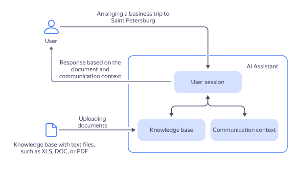

# {{ assistant-api }}



{{ assistant-api }} is a tool for creating AI assistants. It can be used to create personalized assistants, implement a generative response scenario with access to information from external sources (known as _retrieval augmented generation_, or [RAG](https://en.wikipedia.org/wiki/Retrieval-augmented_generation)), and save the model's request context.

You can create your AI assistant using the [{{ ml-sdk-full-name }}](../../sdk/index.md) or through API requests in a programming language.

To use {{ assistant-api }} in {{ foundation-models-full-name }}, you need the `ai.assistants.editor` and `ai.languageModels.user` [roles](../../security/index.md#service-roles) or higher for the [folder](../../../resource-manager/concepts/resources-hierarchy.md#folder).

## Assistant components {#content}

{{ assistant-api }} offers a number of abstractions for building a custom chatbot or AI assistant. 

[_Assistant_](../../assistants/api-ref/grpc/Assistant/index.md) determines which model to use and what parameters and instructions to apply. This enables you to configure the model just once and use those settings in the future without needing to provide them every time.

[_Threads_](../../threads/api-ref/grpc/index.md) are used to maintain the historical context of user communication. Each user chat makes an individual thread. By [_running_](../../runs/api-ref/grpc/index.md) your assistant for a specific thread, you call the model and provide it with all the context stored in the thread. [Listen](../../runs/api-ref/grpc/Run/listen.md) the current run for intermediate generation results; the final response, once generated, will become part of the thread.



By default, each time the model starts running, it will reprocess the content of the thread. If a thread holds some large context and you start the assistant after each user message, running it can grow rather expensive. To optimize costs, consider limiting the size of the context to provide: set the [`customPromptTruncationOptions`](../../runs/api-ref/grpc/Run/create.md) parameter when starting your assistant.

For detailed costs of running an assistant, see [Assistant pricing policy](../../pricing.md#rules-assistant).



A [simple assistant](../../operations/assistant/create.md) may be of help in automating routine operations over various data. For example, if you have tailored an effective prompt and settings for a model, you can create an assistant and run it for different threads. However, your assistants can do much more if equipped with a number of supplementary _tools_.

With {{ assistant-api }}, your assistant can access RAG tools to retrieve information from external sources or function calling tools to invoke additional handlers and third-party APIs.



The retention period for assistants, threads, search indexes, and users is limited. You can set this limit when creating an object using the `ExpirationConfig` parameter. By default, a file not used for seven days is deleted.

Once an object is created, you cannot change its retention period or policy.



## Working with external information sources {#rag}

To interact with external information sources, {{ assistant-api }} relies on a variety of RAG techniques and a tailored [model for paraphrasing](./rephraser.md) user search queries to improve search quality. 

For the model to use information from your own sources, do the following:
1. [Upload the files](#files) using the API or {{ ml-sdk-name }}.
1. Create a [search index](./search-index.md) for your files. After that, you can delete the files you uploaded if you do not need citations.
1. Connect the search index to your assistant. You can enable [citations](./files.md#citations) if the search index files are not deleted.
1. If you need to, [enable](../../operations/assistant/rephraser.md) the paraphrase model as an additional layer in your assistant. 

## Use cases {#examples}

* [{#T}](../../operations/assistant/create.md)
* [{#T}](../../operations/assistant/create-with-searchindex.md)
* [{#T}](../../operations/assistant/request-chunked-response.md)
* [{#T}](../../tutorials/pdf-searchindex-ai-assistant.md)
* [{#T}](../../operations/assistant/create-with-labels.md)
* [{#T}](../../operations/assistant/rephraser.md)