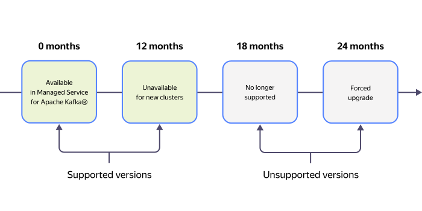

# {{ KF }} versioning policy



{{ KF }} versioning policy applies starting from version 3.4.



{{ KF }} releases new versions three times a year according to the [official documentation](https://cwiki.apache.org/confluence/display/KAFKA/Time+Based+Release+Plan#TimeBasedReleasePlan-WhatIsOurEOLPolicy?).

Each version in the {{ yandex-cloud }} infrastructure has [lifecycle stages](#version-lifecycle) assigned depending on its open-source release date. If the {{ KF }} version used in a {{ mkf-name }} cluster becomes obsolete, it gets updated.

Updating to current versions allows you to get new features, patches, and security fixes, which improves the overall stability of the cluster.

## Version lifecycle stages {#version-lifecycle}

Each version has the following key stages:

| Version state | Description | Status transition date (starting from the open-source release date) |
|:---|:---|:---|
| **Supported versions** |
| Availability in {{ mkf-name }} | You can use this version to create and manage new clusters. | 0 months |
| Unavailability for new clusters | You cannot use this version to create new clusters, but the existing ones will continue to operate. | 12 months |
| **Unsupported versions** |
| Support discontinued | Support and updates were discontinued. | 18 months |
| Forced update | The existing clusters are updated forcibly. | 24 months |



We recommend [updating clusters](../operations/cluster-version-update.md) manually to the supported versions without waiting for an automatic update. This enables you to test compatibility of your applications with the new version in advance.



## Version support schedule {#version-schedule}

Each version is supported for at least 18 months from the date it was added to {{ mkf-name }}.

| Version / Status | Available in {{ mkf-name }} | Unavailable for new clusters | Support discontinued | Forced update |
|:---|:---|:---|:---|:---|
| 2.8 | N/A | March 1, 2025 | September 1, 2025 (estimated) | September 15, 2025 (estimated) |
| 3.0 | Q1 2022  | March 1, 2025 | September 1, 2025 (estimated) | September 15, 2025 (estimated) |
| 3.1 | Q2 2022  | March 1, 2025 | September 1, 2025 (estimated) | September 15, 2025 (estimated) |
| 3.2 | Q3 2022  | March 1, 2025 | September 1, 2025 (estimated) | September 15, 2025 (estimated) |
| 3.3 | Q1 2023  | March 1, 2025 | September 1, 2025 (estimated) | September 15, 2025 (estimated) |
| 3.4 | Q2 2023  | September 1, 2025 | March 1, 2026 | September 1, 2026 |
| 3.5 | Q4 2023  | September 1, 2025 | March 1, 2026 | September 1, 2026 |
| 3.6 | Q1 2025  | March 1, 2026 | September 1, 2026 | March 1, 2027 |
| 3.7 | Q2 2025  | July 1, 2026 | January 1, 2027 | July 1, 2027 |
| 3.8 | Q2 2025  | July 1, 2026 | January 1, 2027 | July 1, 2027 |
| 3.9 | Q2 2025  | July 1, 2026 | January 1, 2027 | July 1, 2027 |



**Version 3.9**: Starting from this version, cluster migration from {{ ZK }} to {{ kraft-short-name }} is available.

**Version 4.0+**: {{ ZK }} support was fully discontinued (only {{ kraft-name }} remains available).



## Update policy {#update-policy}

A {{ mkf-name }} cluster running a discontinued version is updated to the nearest supported version.



The notification system provides the following notifications:

- **90 days** prior to a version’s transition to the **Support discontinued** status.
- **30 days** prior to a version’s transition to the **Forced update** status.
- **7 days** prior to the start of a version’s forced update.

