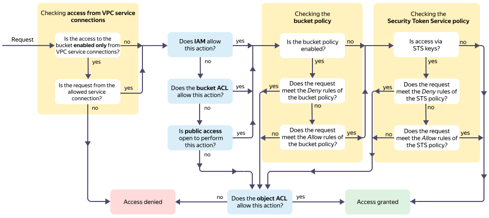

# Access management methods in {{ objstorage-name }}: Overview

{{ objstorage-name }} uses various access management methods:
* [{{ iam-full-name }} ({{ iam-short-name }})](#iam)
* [Access control list (ACL)](#acl)
* [Bucket policy](#policy)
* [Public access](#anonymous)
* [{{ sts-name }}](#sts)
* [Pre-signed URLs](#pre-signed)
* [{{ vpc-short-name }} service connections](#pe-vpc)

Also, enabled encryption may affect access to buckets and objects in {{ objstorage-name }}. For more information about working with encrypted buckets, see [{#T}](../concepts/encryption.md).

The flow chart below shows how these access management methods work together in {{ objstorage-name }}. {#scheme}

The checks follow this algorithm:

1. _IAM_ and _bucket ACL_:
    * If the request passes the _IAM_ **or** _bucket ACL_ check, it is checked whether the _bucket policy_ is configured.
    * If the request fails the _IAM_ **and** _bucket ACL_ checks, it is checked whether _public access_ to the bucket is enabled.
1. _Public access_:
    * If public access to perform the action is enabled, it is checked whether the _bucket policy_ is configured.
    * If public access to perform the action is denied, an access check based on the _object ACL_ is performed.
1. _Bucket policy_:
    * If the bucket policy is configured:
      1. If the request meets at least one of the `Deny` rules in the bucket policy, an access check based on the _object ACL_ is performed.
      1. If the request meets at least one of the `Allow` rules in the bucket policy, it is checked whether there is access via _{{ sts-name }}_.
      1. If the request does not meet any of the bucket policy rules, an access check based on the _object ACL_ is performed.
    * If the bucket policy is not configured, it is checked whether there is access via _{{ sts-name }}_.
1. _{{ sts-name }}_:
    * If the request is made using {{ sts-name }}:
      1. If the request meets at least one of the `Deny` rules in the policy for the temporary key, an access check based on the _object ACL_ is performed.
      1. If the request meets at least one of the `Allow` rules in the policy for the temporary key, access will be allowed.
      1. If the request does not meet any of the policy rules for the temporary key, an access check based on the _object ACL_ is performed.
    * If the request is made directly, access will be allowed.
1. _Object ACL_:
    * If the request passes the _object ACL_ check, access will be allowed.
    * If the request fails the _object ACL_ check, access will be denied.

## {{ iam-name }} {#iam}

[{{ iam-name }}](./index.md) is a main method for managing access in {{ yandex-cloud }} using roles. It enables the basic access control policy. For more details, see [{#T}](./index.md#roles-list).

Access grantees: 
* Yandex account
* [Service account](../../iam/concepts/users/service-accounts.md)
* [Federated user](../../iam/concepts/federations.md)
* [System group](../../iam/concepts/access-control/system-group.md)
* [Public group](../../iam/concepts/access-control/public-group.md)

Access is granted for a [cloud](../../resource-manager/concepts/resources-hierarchy.md#cloud), [folder](../../resource-manager/concepts/resources-hierarchy.md#folder), or [bucket](../concepts/bucket.md).

## Access control list (ACL) {#acl}

An [access control list (ACL)](./acl.md) is a list of action permissions stored directly in {{ objstorage-name }}. It enables the basic access control policy. ACL permissions for buckets and objects are different; see [{#T}](./acl.md#permissions-types) for details.



If you do not need to differentiate access to specific objects, we recommend using {{ iam-name }}.



Access grantees: 
* Yandex account
* [Service account](../../iam/concepts/users/service-accounts.md)
* [Federated user](../../iam/concepts/federations.md)
* [System group](../../iam/concepts/access-control/system-group.md)
* [Public group](../../iam/concepts/access-control/public-group.md)

Access is granted for a [bucket](../concepts/bucket.md) or [object](../concepts/object.md).

## Bucket policy {#policy}

A [bucket policy](./policy.md) is a list of rules that prohibit or allow [actions](../s3/api-ref/policy/actions.md) when certain [conditions](../s3/api-ref/policy/conditions.md) are met. It allows you to granularly differentiate access to buckets, objects, and groups of objects.

Access grantees: 
* Yandex account
* [Service account](../../iam/concepts/users/service-accounts.md)
* [Federated user](../../iam/concepts/federations.md)
* Anonymous user

Access is granted for a [bucket](../concepts/bucket.md), [object](../concepts/object.md), or a group of objects.

## Public access {#anonymous}

[Public access](./public-access.md) defines access permissions for anonymous users to read objects, list of objects, and bucket settings.

Access is granted for a [bucket](../concepts/bucket.md).



## {{ sts-name }} {#sts}

[{{ sts-name }}](./sts.md) is an {{ iam-name }} component to get temporary access keys compatible with [AWS S3 API](../s3/index.md).

With temporary keys, you can set up granular access to buckets for multiple users with a single service account.

## Pre-signed URLs {#pre-signed}

[Pre-signed URLs](./pre-signed-urls.md) are a way of giving anonymous users temporary access to certain actions in {{ objstorage-name }} using URLs that contain request authorization data in their parameters.

Access is granted for a [bucket](../concepts/bucket.md) or [object](../concepts/object.md).

## {{ vpc-short-name }} service connections {#pe-vpc}





In {{ objstorage-name }}, you can configure your bucket so that it is only accessible via {{ vpc-short-name }} service connections. The following mechanisms are provided:
* **Policy-level bucket access restriction**: Bucket can be accessed from {{ vpc-short-name }} service connections with IDs specified in the policy. However, as the [flow chart](#scheme) shows, the bucket will still be accessible from the public network, e.g., though an object [ACL](#acl) or under another enabling rule in the policy. In addition, a bucket configured this way still supports [server-side copy](../operations/objects/copy.md), both from and to the bucket. For more information, see [Configure a bucket policy for access from service connections](../operations/buckets/access-via-vpc.md#setup-policy).
* **Service-level bucket access restriction**: Bucket can be accessed only from {{ vpc-short-name }} service connections. Remember to specify particular names of connections. The bucket will not be accessible from the public network. This mechanism, as currently implemented, also blocks access to the bucket from the [management console]({{ link-console-main }}). For more information, see [Configure a restriction for access only from service connections](../operations/buckets/access-via-vpc.md#setup-service-restriction).



## See also {#see-also}

* [{#T}](../operations/buckets/iam-access.md)
* [{#T}](../operations/buckets/edit-acl.md)
* [{#T}](../operations/objects/edit-acl.md)
* [{#T}](../operations/buckets/policy.md)
* [{#T}](../operations/buckets/bucket-availability.md)
* [{#T}](../operations/buckets/create-sts-key.md)
* [{#T}](../operations/buckets/access-via-vpc.md)