# Примеры создания QL-чартов





В этом руководстве вы создадите чарты на основе SQL-запросов. SQL-запросы позволяют гибче настраивать данные для визуализации, чем стандартный способ — через датасет. Например, в SQL-запрос вы можете добавить параметры с дашбордов.

Рекомендуем использовать [QL-чарт](../../datalens/concepts/chart/ql-charts.md) в случае, если создание обычного [чарта](../../datalens/concepts/chart/dataset-based-charts.md) с помощью датасета вам не подходит или вы хотите поэкспериментировать с данными.

В качестве источника данных будет использоваться прямое подключения к демонстрационной БД. 


Для визуализации и исследования данных [подготовьте {{ datalens-short-name }} к работе](#before-you-begin), затем выполните следующие шаги:


1. [Создайте воркбук](#create-workbook).
1. [Создайте подключение](#create-connection).
1. [Создайте QL-чарт](#create-sql-chart).
1. [Создайте дашборд](#create-dashboard).
1. [Добавьте QL-чарт на дашборд](#add-sql-chart-to-dashboard).
1. [Добавьте селекторы на дашборд](#add-selectors-to-dashboard).



SQL-запросы работают только с базами данных. File, GoogleSheets, Яндекс Метрика и другие сервисные подключения не поддерживают SQL-запросы.




## Перед началом работы {#before-you-begin}



## Создайте воркбук {#create-workbook}

1. Перейдите на [главную страницу]({{ link-datalens-main }}) {{ datalens-short-name }}.
1. На панели слева выберите  **Коллекции и воркбуки**.
1. В правом верхнем углу нажмите **Создать** → **Создать воркбук**.
1. Введите название [воркбука](../../datalens/workbooks-collections/index.md) — `Практические руководства`.
1. Нажмите кнопку **Создать**.


## Создайте подключение {#create-connection}

Для доступа к базе данных будет создано подключение **Sample ClickHouse**.



## Создайте QL-чарт {#create-sql-chart}

Создайте QL-чарт на базе подключения `Sample ClickHouse`:

1. На странице подключения в правом верхнем углу нажмите кнопку **Создать датасет**.

   

   Убедитесь, что в подключении активирована настройка **Уровень доступа SQL-запросов** → **Разрешить подзапросы в датасетах и запросы из чартов**.

   

1. В правом верхнем углу нажмите **Создать QL-чарт**.
1. На вкладке **Запрос** введите текст запроса:

   ```sql
   SELECT 
      toDate(t1.OrderDatetime) as "Дата",
      COUNT(t1.ClientID) as "Число новых клиентов", t3.ClientStatus as "Статус"
   FROM
      samples.MS_SalesFacts t1,
      (SELECT 
	      ClientID, 
         MIN(OrderDatetime) as FirstDate
      FROM samples.MS_SalesFacts
      GROUP BY ClientID) as t2,
         samples.MS_Clients t3
   WHERE not_var{{interval_from}} < "Дата" and "Дата" < not_var{{interval_to}} and t1.ClientID=t2.ClientID and t3.ClientID=t2.ClientID and t3.ClientStatus in not_var{{status}} -- status, interval_from и interval_to - переменные, связанные с параметрами, на которые влияют селекторы
   GROUP BY "Статус", "Дата"
   ORDER BY "Дата"
   ```

1. На вкладке **Параметры** нажмите **Добавить параметр** и заполните поля ввода:

   * Из выпадающего списка выберите `string` (по умолчанию).
   * В поле **Имя** введите `status`.
   * В поле **Значение по умолчанию** введите `Золотой`.
   * Ниже нажмите **Добавить значение** и введите `Серебряный`.
   * Ниже нажмите **Добавить значение** и введите `Базовый`.

     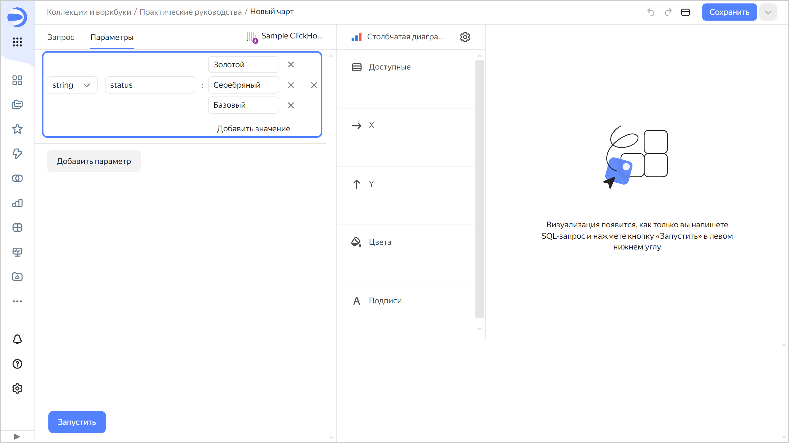

   Добавленный параметр будет связан с переменной `not_var{{status}}` в запросе.

1. Нажмите **Добавить параметр** и заполните поля ввода:

   * Из выпадающего списка выберите `date-interval`.
   * В поле **Имя** введите `interval`.
   * Нажмите на поле со значением периода и в открывшемся окне укажите:

     * **Начало:** `01.03.2017`;
     * **Конец:** `31.03.2017`.

       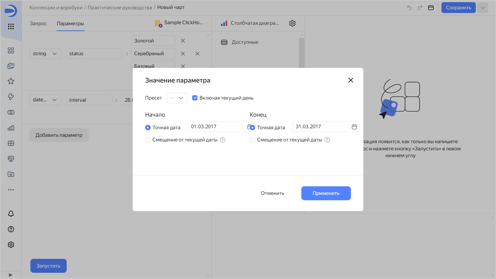

     * Нажмите **Применить**.

     Значения **Начало:** и **Конец:** добавленного параметра будут связаны соответственно с переменными `not_var{{interval_from}}` и `not_var{{interval_to}}` в SQL-запросе.

     
   
     Значениями параметров можно управлять при помощи селекторов на дашборде.

     

1. Вернитесь на вкладку **Запрос**. В левом нижнем углу нажмите кнопку **Запустить**. После выполнения запроса появится визуализация в правом окне.

   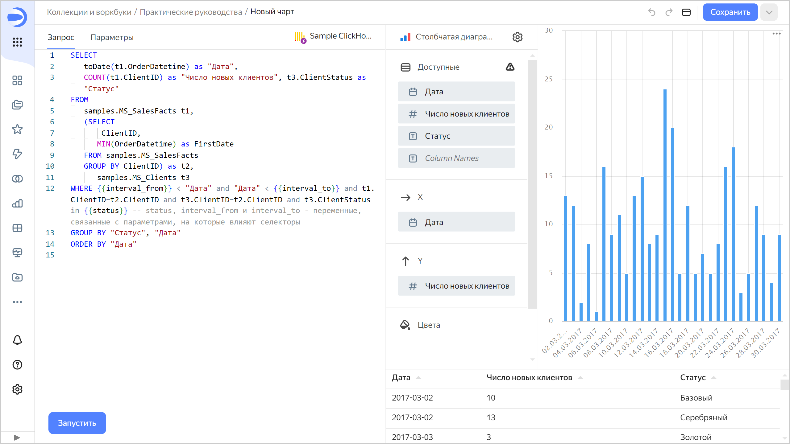

1. Настройте визуализацию:

   * Убедитесь, что в секции **X** находится поле `Дата`, иначе перетащите его из раздела **Доступные**.
   * Убедитесь, что в секции **Y** находится поле `Число новых клиентов`, иначе перетащите его из раздела **Доступные**.
   * Добавьте на график цветовое разделение клиентов по статусу. Для этого из секции **Доступные** перетащите поле `Статус` в секцию **Цвета**.

     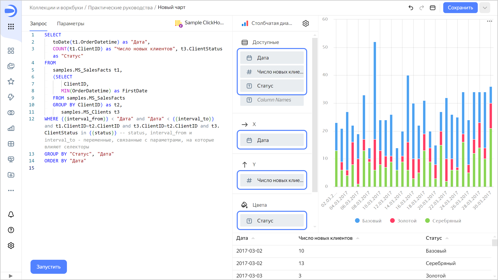

1. Сохраните чарт:

   1. В правом верхнем углу нажмите кнопку **Сохранить**.
   1. В открывшемся окне введите название чарта `Новые клиенты` и нажмите кнопку **Сохранить**.

Можете разместить созданный чарт на дашборде. Также на дашборд можно добавить селекторы для управления значениями параметров `status` и `interval` QL-чарта.

## Создайте дашборд {#create-dashboard}

Создайте [дашборд](../../datalens/concepts/dashboard.md), на который будут добавлены чарты и другие виджеты:


1. На панели слева выберите  **Коллекции и воркбуки** и перейдите в воркбук `Практические руководства`.
1. В правом верхнем углу нажмите **Создать** →  **Дашборд**.


## Добавьте QL-чарт на дашборд {#add-sql-chart-to-dashboard}

1. На панели в нижней части страницы зажмите  **Чарт** и перетащите его в нужную область.

   

1. В открывшемся окне нажмите кнопку **Выбрать**.
1. Выберите чарт `Новые клиенты`.

   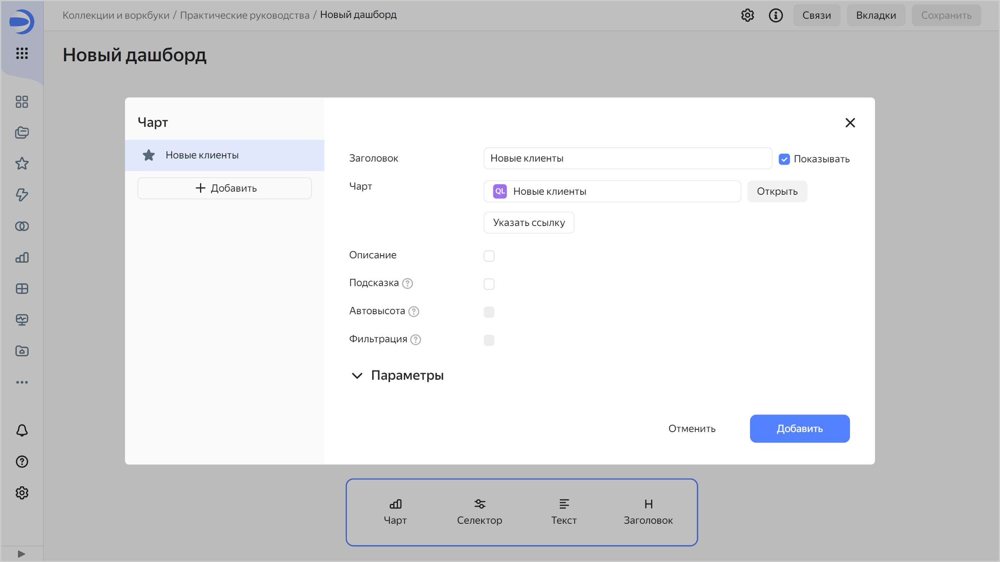

1. Нажмите кнопку **Добавить**.
1. Установите размер чарта с помощью мыши и расположите его на дашборде в удобном для вас месте.

   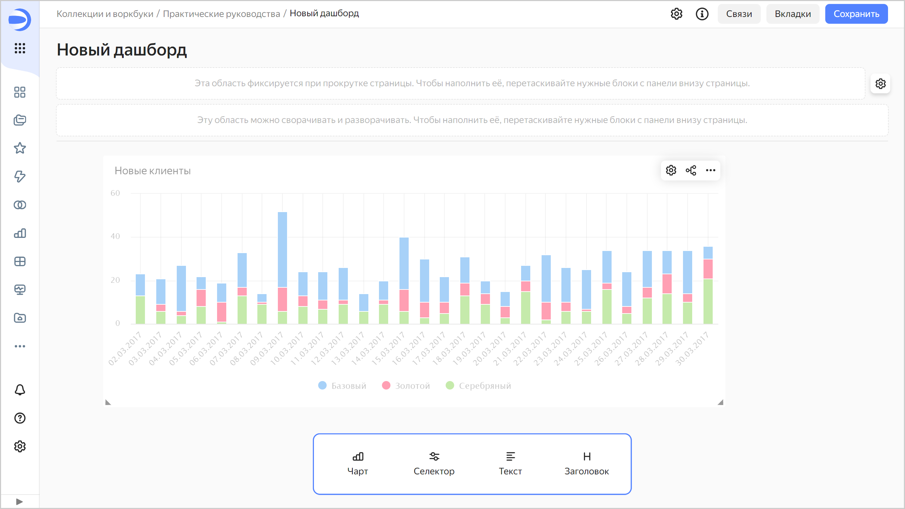

## Добавьте селекторы на дашборд {#add-selectors-to-dashboard}

Добавьте [селекторы](../../datalens/dashboard/selector.md), чтобы фильтровать чарты по дате и статусам клиентов:

1. На панели в нижней части страницы зажмите   **Селектор** и перетащите его в нужную область.

   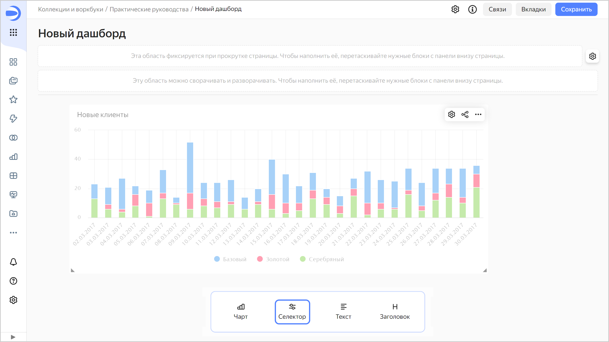

1. Добавьте селектор по статусам клиентов:

   1. В списке **Источник** выберите `Ручной ввод`.
   1. В **Поле или параметр** введите `status`. В эту переменную SQL-запроса будут передаваться выбранные значения из селектора.
   1. Выберите тип селектора `Список`.   
   1. Включите опцию **Множественный выбор**.
   1. Рядом с параметром **Возможные значения** нажмите кнопку **Добавить**. В открывшемся окне добавьте значения:

      * Золотой
      * Серебряный
      * Базовый

      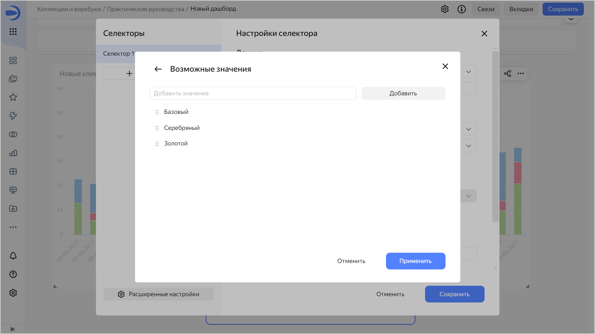

      Нажмите кнопку **Применить**.

   1. В списке **Значение по умолчанию** укажите **Выбрать всё**.

      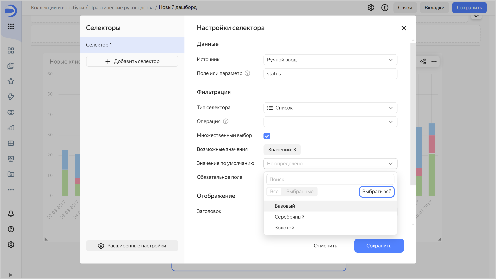

   1. В поле **Заголовок** введите `Выберите статус клиента`.
   1. Нажмите кнопку **Сохранить**.

      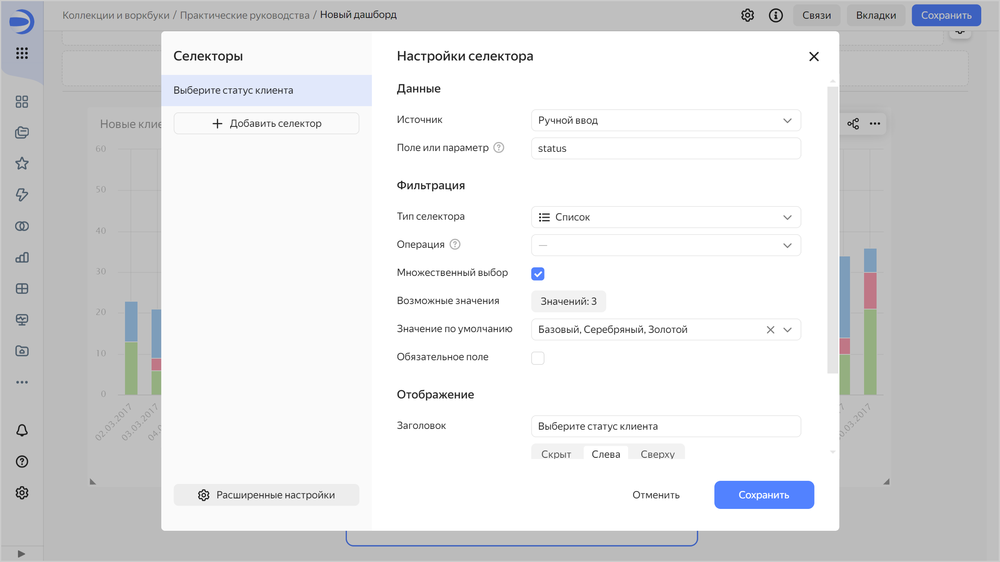

1. Добавьте селектор с календарем для фильтрации по диапазону дат:

   1. В списке **Источник** выберите `Ручной ввод`.
   1. В **Поле или параметр** введите `interval`. В переменные `not_var{{interval_from}}` и `not_var{{interval_to}}` SQL-запроса будут передаваться значения начала и конца диапазона из селектора.
   1. Выберите тип селектора `Календарь`.
   1. Включите опцию **Диапазон**.
   1. В поле **Заголовок** введите `Период заказов`.
   1. Нажмите кнопку **Сохранить**.

      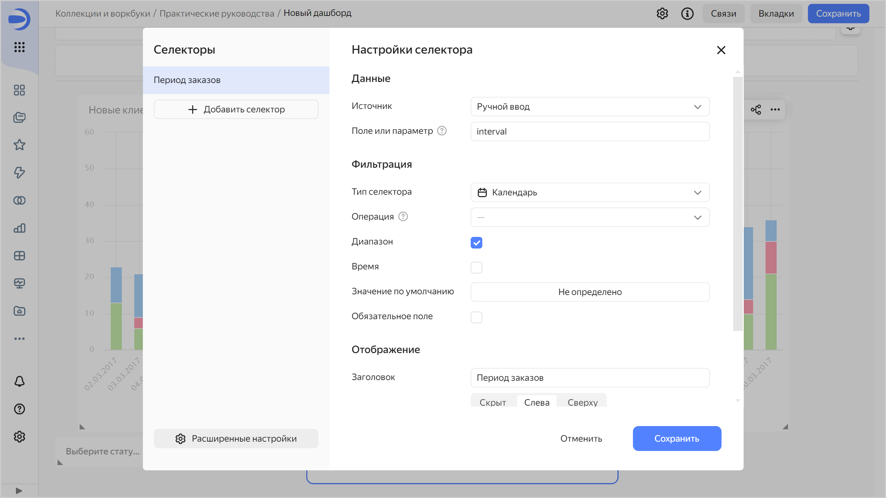

1. Расположите селекторы на дашборде в удобном для вас порядке.
1. Сохраните дашборд:

   1. В правом верхнем углу дашборда нажмите кнопку **Сохранить**.
   1. Введите название дашборда `Динамика количества клиентов по годам` и нажмите кнопку **Создать**.

Дашборд готов.

   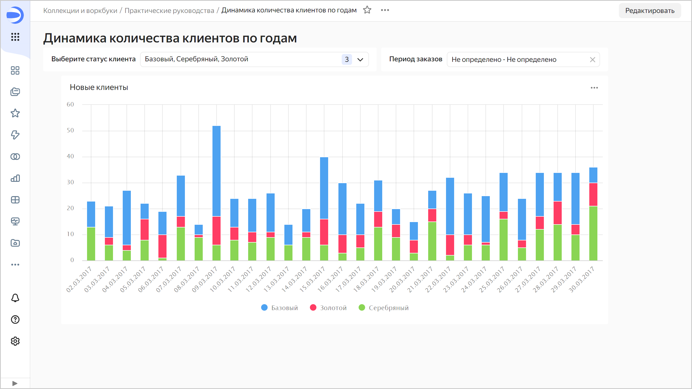

1. Дашборд готов. Теперь можно фильтровать чарт по статусу с использованием селектора.
   
   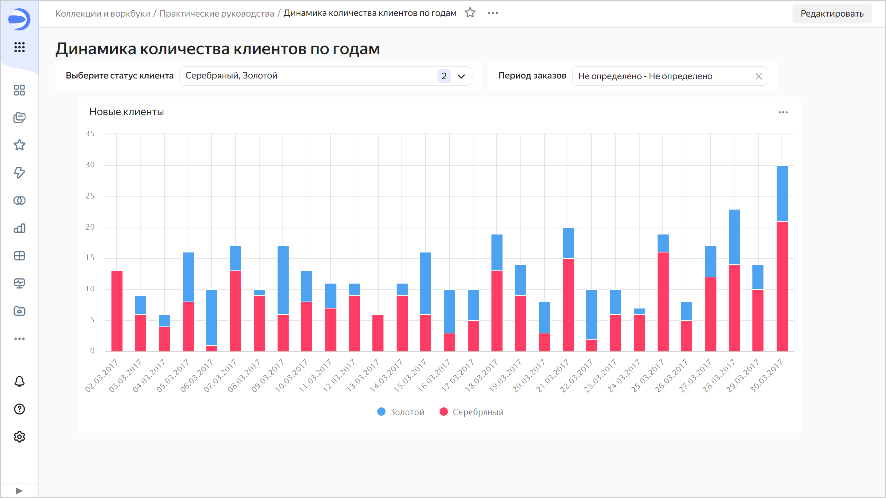

   Также можно фильтровать чарт по диапазону дат с использованием второго селектора.

   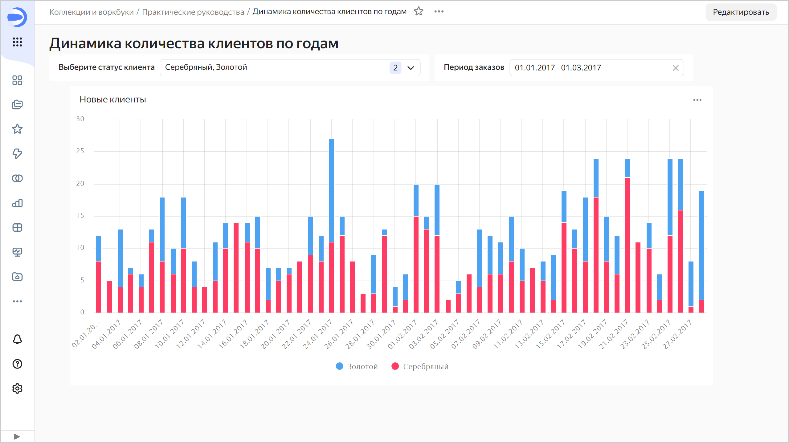

#### См. также {#see-also}

- [{#T}](../../datalens/operations/dashboard/add-chart.md)
- [{#T}](../../datalens/operations/dashboard/add-selector.md)
- [{#T}](../../datalens/operations/chart/create-sql-chart.md)
- [QL-чарты](../../datalens/concepts/chart/index.md#sql-charts)
