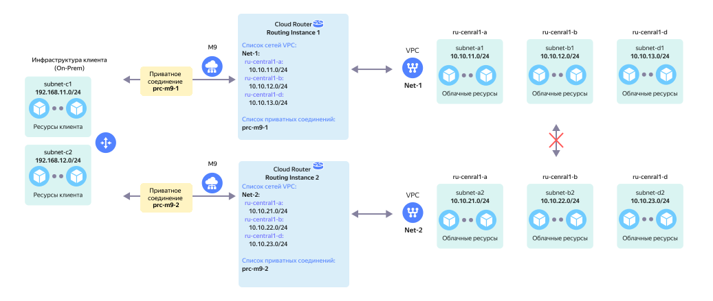

# Два отдельных RI без резервирования On-Prem

Две отдельные независимые сетевые топологии. В каждой топологии к `RI` с одной стороны подключается [приватное соединение](../../interconnect/concepts/priv-con.md), а с другой стороны — [виртуальная облачная сеть](../../vpc/concepts/network.md).

На схеме выше представлена сетевая топология в следующей конфигурации:

* `On-Prem` клиента с двумя локальными подсетями — `subnet-c1` и `subnet-c2`.
* Сетевое оборудование On-Prem подключается через сервис [Cloud Interconnect](../../interconnect/concepts/index.md) к сетевому оборудованию {{ yandex-cloud }}.
* [Приватное соединение](../../interconnect/concepts/priv-con.md) `prc-m9-1` через [точку присутствия](../../interconnect/concepts/pops.md) `M9` подключается к `Routing Instance 1` в {{ yandex-cloud }}.
* Со стороны {{ yandex-cloud }} к `RI 1` подключается виртуальная сеть `Net-1` в составе трех подсетей — `subnet-a1`, `subnet-b1` и `subnet-d1`.
* [Приватное соединение](../../interconnect/concepts/priv-con.md) `prc-m9-2` через [точку присутствия](../../interconnect/concepts/pops.md) `M9` подключается к `Routing Instance 2` в {{ yandex-cloud }}.
* Со стороны {{ yandex-cloud }} к `RI 2` подключается виртуальная сеть `Net-2` в составе трех подсетей — `subnet-a2`, `subnet-b2` и `subnet-d2`.

Таким образом, образуются две сетевые топологии (по количеству используемых `RI`):

* Топология 1 — обеспечивает связность между подсетями в On-Prem и подсетями в VPC `Net-1` через `RI 1`.
* Топология 2 — обеспечивает связность между подсетями в On-Prem и подсетями в VPC `Net-2` через `RI 2`.

Данные топологии не обеспечивают сетевую связность между подсетями виртуальных сетей `Net-1` и `Net-2`.



При необходимости клиент может обеспечить сетевую связность между подсетями в VPC `Net-1` и `Net-2`, настроив маршрутизацию трафика между приватными соединениями на своем сетевом оборудовании.



