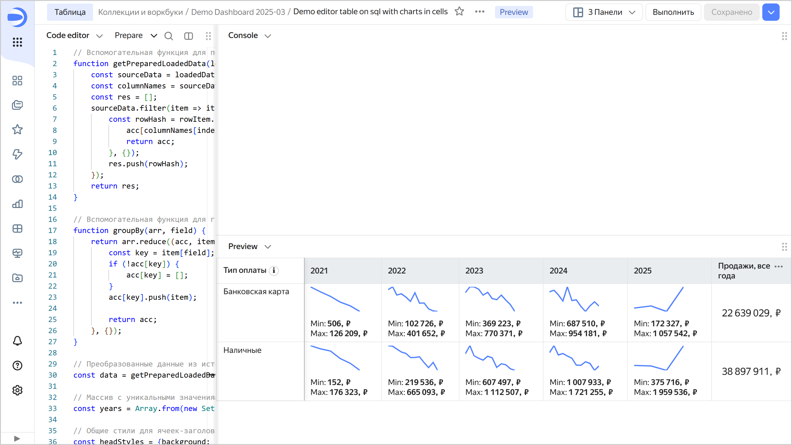

# Построение таблицы на основе SQL-запроса к источнику данных





Следуя данной инструкции, вы построите в Editor таблицу на основе SQL-запроса к источнику данных. Для удобства в качестве источника данных мы будем использовать подключение и датасет из развернутого демо-воркбука.

## Перед началом работы {#before-you-begin}





## Разверните демо-воркбук {#create-template}


1. [Разверните из маркетлейса](../../../operations/marketplace/add-marketplace-product.md) демо-воркбук с названием [Demo Dashboard](https://datalens.yandex.cloud/marketplace/f2eui5ar8omalpcg1j3r).


1. Перейдите в развернутый воркбук и на вкладке **Подключения** найдите подключение с названием `00: Demo Dashboard. Connection`.

1. Скопируйте идентификатор подключения: рядом с ним нажмите на  → **Копировать ID**. Идентификатор будет скопирован в буфер обмена.

### Создайте чарт в Editor {#create-chart}

1. В воркбуке в правом верхнем углу нажмите **Создать** → **Чарт в Editor**. На открывшейся странице выберите тип визуализации **Таблица**.

1. Свяжите чарт с подключением: для этого перейдите на вкладку **Meta** и добавьте ID подключения в `links`:

   ```javascript
   {
       "links": {
           "demoConnection": "<id_подключения>"
       }
   }
   ```

   Где:
   * `<id_подключения>` — идентификатор подключения, скопированный на предыдущем шаге.
   * `demoConnection` — произвольное имя-алиас, которое вы присваиваете подключению, с помощью которого запрашиваете данные для чарта из источника.

   
   
   Вкладка **Meta** нужна для описания служебной информации о списке связанных сущностей. Эта информация используется для определения, с какими подключениями и датасетами связан чарт, а также для диалога связанных объектов, при копировании воркбука и при публикации в Public.

   

1. Получите данные из источника: для этого откройте вкладку **Source** и укажите:

   ```javascript
   module.exports = {
       'salesSourceData': {
           qlConnectionId: Editor.getId('demoConnection'),
           data: {
               sql_query: `
               SELECT
                   t1."PaymentType" AS PaymentType,
                   toYear(toDate(t1."OrderDatetime")) AS OrderYear,
                   toStartOfInterval(toDate(toDate(t1."OrderDatetime")), interval 1 month) AS OrderMonth,
                   sum(toFloat64(t1."Price")) AS PriceSum
               FROM samples."MS_SalesFacts_up" AS t1
               GROUP BY PaymentType, OrderYear, OrderMonth
               LIMIT 1000001`,
           },
       },
   };
   ```

   `salesSourceData` — произвольное имя-алиас, которое вы присваиваете объекту с запрошенными данными чарта, которое используется для доступа на вкладке **Prepare**.

   В значении поля `sql_query` описывается запрос к источнику данных подключения.

1. Очистите содержимое вкладок **Params** и **Config**: они содержат шаблон, не относящийся к нашему примеру.

1. На вкладке **Prepare** сформируйте таблицу:

   ```javascript
   // Вспомогательная функция для подготовки полученных из источника данных в более удобном виде
   function getPreparedLoadedData(loadedData, sourceName) {
       const sourceData = loadedData[sourceName];
       const columnNames = sourceData.filter(item => item.event === 'metadata').map(item => item.data.names)?.[0] || [];
       const res = [];
       sourceData.filter(item => item.event === 'row').map(item => item.data).forEach(rowItem => {
           const rowHash = rowItem.reduce((acc, field, index) => {
               acc[columnNames[index]] = field;
               return acc;
           }, {});
           res.push(rowHash);
       });
       return res;
   }
   
   // Вспомогательная функция для группировки данных по заданному имени поля 
   function groupBy(arr, field) {
       return arr.reduce((acc, item) => {
           const key = item[field];
           if (!acc[key]) {
               acc[key] = [];
           }
           acc[key].push(item);
           
           return acc;
       }, {});
   }
   
   // Преобразованные данные из источника в удобном формате
   const data = getPreparedLoadedData(Editor.getLoadedData(), 'salesSourceData');
   
   // Массив с уникальными значениями из поля "OrderYear", отсортированное по возрастанию чисел
   const years = Array.from(new Set(data.map(d => String(d['OrderYear'])))).sort();
   
   // Общие стили для ячеек-заголовков таблицы
   const headStyles = {background: 'var(--g-color-base-misc-light)', verticalAlign: 'middle'};
   
   // Конфигурация ячеек-заголовков таблицы
   const head = [
       {
           name: 'Тип оплаты',
           formattedName: Editor.generateHtml({
               tag: 'span',
               content: [
                   {tag: 'span', content: 'Тип оплаты'},
   				// всплывающая подсказка для заголовка ячейки
                   {
                       tag: 'dl-tooltip',
                       content: ' ℹ',
                       style: {
                           display: 'inline-block',
                           margin: '0px 0px 0px 4px',
                           'line-height': '12px',
                           'text-align': 'center',
                           width: '16px',
                           height: '16px',
                           border: '1px solid #ccc',
                           'border-radius': '50%',
                       },
                       attributes : {
                           'data-tooltip-content': {
                               tag: 'i',
                               content: 'Tooltip content',
                           },
                       },
                   }
               ],
           }),
           css: headStyles,
           pinned: true,
       },
       // Формируем колонки по полученному выше массиву со значениями из поля "OrderYear"
       ...years.map(year => ({
           name: year,
           css: headStyles,
       })),
       {
           name: 'Продажи, все года',
           css: headStyles,
       },
   ];
   
   // Вспомогательная функция для отрисовки линии чарта
   function createChart(chartData) {
       const chartWidth = 80;
       const chartHeight = 40;
   
       // Вычисляем минимальное и максимальное значение координат
       const minX = Math.min(...chartData.map(d => d.x));
       const maxX = Math.max(...chartData.map(d => d.x));
       const minY = Math.min(...chartData.map(d => d.y));
       const maxY = Math.max(...chartData.map(d => d.y));
   
       // Вычисляем координаты в зависимости от размеров контейнера чарта (chartWidth, chartHeight)
       const coords = chartData.sort((d1, d2) => d1.x - d2.x).map(d => ([
           (d.x - minX) / (maxX - minX) * chartWidth, 
           (d.y - minY) / (maxY - minY) * chartHeight,
       ]));
       // Создаем путь для svg-линии по сформированным выше координатам
       let d = "";
       coords.forEach((_, x) => {
           d += d === "" ? "M" : " L";
           d += `${coords[x][0]} ${coords[x][1]}`;
       });
       // Создаем svg с цветом линии var(--g-color-base-brand) и толщиной 2px
       return `
           <svg width="${chartWidth}" height="${chartHeight}">
               <path 
                   d="${d}" 
                   style="fill: none; stroke: var(--g-color-base-brand); stroke-width: 2;"
               />
           </svg>`;
   }
   
   const rows = [];
   
   // Вспомогательная функция форматирования чисел
   const formatSalesValue = new Intl.NumberFormat('ru-RU').format;
   const postfix = ', ₽';
   
   // Сгруппированные строки по полю "PaymentType"
   const groupedData = groupBy(data, 'PaymentType');
   
   // Формируем и наполняем строки таблицы для каждого сгруппированного типа оплаты (на основе значения поля PaymentType)
   Object.entries(groupedData).forEach(([key, items]) => {
       // Сгруппированные строки по полю "OrderYear"
       const salesByYears = groupBy(items, 'OrderYear');
       // Вычисляем сумму по полю "PriceSum" по всем годам (сформированных на основе OrderYear)
       const totalSales = items.reduce((sum, d) => sum + d['PriceSum'], 0);
       rows.push({
           cells: [
               {
                   value: key,
               },
               // Формируем колонки по подготовленным ранее значениям "OrderYear"
               ...years.map(year => {
                   const salesByYear = salesByYears[year] ?? [];
                   const yearSales = salesByYear.map(d => ({
                       x: new Date(d['OrderMonth']).getTime(), 
                       y: d['PriceSum'],
                   }));
                   const maxSales = Math.max(...salesByYear.map(d => d['PriceSum']));
                   const minSales = Math.min(...salesByYear.map(d => d['PriceSum']));
   
                   return {
                       value: maxSales, 
                       formattedValue: Editor.generateHtml(`
                           <div>
                               ${createChart(yearSales)}
                               <div style="margin-top: 8px;">Min: <b>${formatSalesValue(minSales)}${postfix}<b></div>
                               <div>Max: <b>${formatSalesValue(maxSales)}${postfix}</b></div>
                           </div>
                       `),   
                   };
               }),
               {
                   value: totalSales,
                   formattedValue: formatSalesValue(totalSales) + postfix,
                   css: {
                       verticalAlign: 'middle',
                       textAlign: 'center',
                       fontSize: '16px',
                   },
               },
           ],
       });
   });
   
   module.exports = {head, rows};
   ```

1. Вверху чарта нажмите **Выполнить**. В области предпросмотра отобразится таблица с данными из подключения со сгруппированными строками по полю **PaymentType** и сгруппированными колонками по полю **OrderYear** с графиком по значениям продаж по месяцам:

    

1. Чтобы сохранить чарт, в правом верхнем углу нажмите **Сохранить** и введите название чарта.