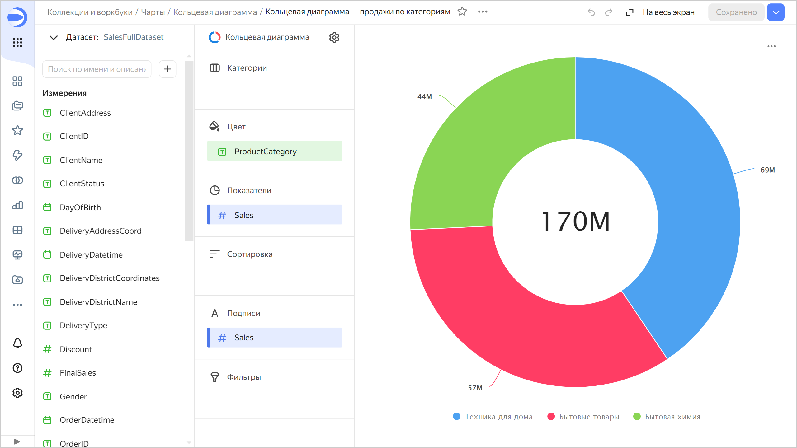
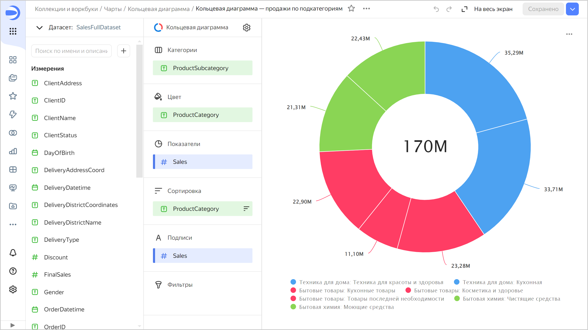
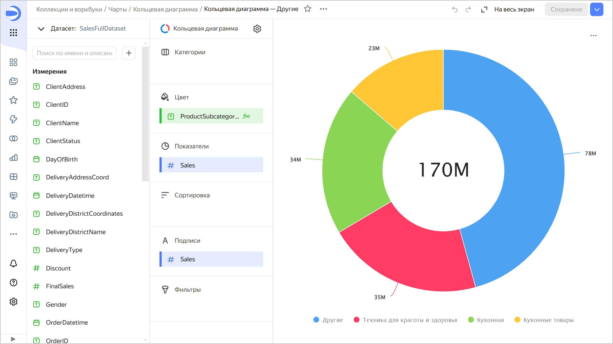

# Кольцевая диаграмма 

Диаграмма отображает отношение между категориями при помощи сегментов кольца. Сумма всех сегментов составляет 100%. Размер каждого сегмента соответствует доле категории в общей сумме. Число в центре кольца зависит от выбранного показателя и отражает общий итог. Кольцевые диаграммы подходят для отображения небольшого количества сегментов.





Категории товаров | Продажи |	
-----|---------| 
Техника для дома | 69М |
Бытовые товары | 57М |
Бытовая химия | 44М |



Несколько мелких сегментов, которые относятся к более крупной категории, можно выделить одним цветом.



## Секции в визарде {#wizard-sections}

Секция<br/> в визарде| Описание
----- | ----
Категории | Измерение. Может быть указано только одно поле. По нему производится группировка данных.
Цвет | Измерение. Может быть указано только одно поле. По нему производится раскрашивание сегментов диаграммы.
Показатели | Влияет на размер сегментов кольца. Может быть указано только одно поле. Итоговое значение показателя отображается в центре кольца. В итоговом значении не отображаются расчеты с помощью [LOD-выражений](../concepts/lod-aggregation.md), [оконных функций](../function-ref/window-functions.md) и [функций для работы с временными рядами](../function-ref/time-series-functions.md).
Сортировка | Показатель или измерение из секции **Цвет**. Влияет на сортировку сегментов. Направление сортировки отмечено значком рядом с полем: по возрастанию  или по убыванию . Чтобы изменить направление сортировки, нажмите значок.
Подписи | Показатель. Отображает значения показателя на диаграмме. Чтобы добавить на диаграмму выноски с названиями категорий, перетащите в эту секцию измерение [Measure Names](../concepts/chart/measure-values.md). Поддерживается использование [функций разметки](../function-ref/markup-functions.md). Для полей с типом `Строка` можно настроить использование базового синтаксиса [{#T}](../dashboard/markdown.md): нажмите на значок перед названием поля и включите опцию **Markdown**.
Фильтры | Измерение или показатель. Используется в качестве фильтра.

## Создание кольцевой диаграммы {#create-diagram}

Чтобы создать кольцевую диаграмму:





1. Перейдите на [главную страницу]({{ link-datalens-main }}) {{ datalens-short-name }}.
1. На панели слева выберите  **Чарты**.
1. Нажмите кнопку **Создать чарт** → **Чарт**.
1. Слева вверху нажмите  **Выберите датасет** и укажите датасет для визуализации.
1. Выберите тип чарта **Кольцевая диаграмма**.
1. Перетащите измерение из датасета в секцию **Категории**.
1. Перетащите измерение или показатель из датасета в секцию **Цвет**.
1. Перетащите показатель из датасета в секцию **Показатели**. Значения отобразятся в виде сегментов кольцевой диаграммы.

Чтобы отключить отображение числа в центре:

1. В верхней левой части экрана нажмите значок .
1. В окне **Настройки чарта** выключите опцию **Итоги**.
1. Нажмите **Применить**.

## Рекомендации {#recommendations}

* Если сегментов много, диаграмма выглядит перегружено, а понимать данные становится сложно. При наличии более 4-6 сегментов на одной диаграмме, стоит объединить самые маленькие из них в один сегмент, например `Другие`. Это можно сделать путем обработки данных, например, создав [вычисляемое поле](../concepts/calculations/index.md) в датасете или чарте.

  

  **Исходная таблица**

  ProductSubcategory | Sales |	
  -----|---------| 
  Косметика и здоровье | 11М |
  Кухонная | 34М |
  Кухонные товары | 23М |
  Моющие средства | 22,5М |
  Техника для красоты и здоровья | 35М |
  Товары последней необходимости | 23М |
  Чистящие средства | 21,5М |

  Чтобы объединить несколько сегментов по полю `ProductSubcategory` в общую группу:

  1. Добавьте в чарт новое поле с формулой:

     ```
     CASE [ProductSubcategory]
         WHEN "Техника для красоты и здоровья" THEN "Техника для красоты и здоровья"
         WHEN "Кухонная" THEN "Кухонная"
         WHEN "Кухонные товары" THEN "Кухонные товары"
         ELSE "Другие"
     END
     ```

  1. Перетащите новое поле в секцию **Цвет**.
  1. Перетащите поле `Sales` в секции **Показатели** и **Подписи**.

  Сумма продаж будет подсчитываться отдельно для подкатегорий `Техника для красоты и здоровья`, `Кухонная` и `Кухонные товары`, а для остальных подкатегорий — в группе `Другие`.

  

  

* Объединяйте мелкие сегменты в более крупные группы:
  
  * Для выделения сегментов используйте секцию **Категории**.
  * Для выделения групп используйте секцию **Цвет**.

* На диаграмме нельзя отобразить отрицательные и нулевые значения.
* Не используйте кольцевые диаграммы для отображения изменения пропорций во времени и для точного сравнения данных по категориям.

#### См. также {#see-also}

* [{#T}](../operations/dashboard/create.md)
* [{#T}](../operations/dashboard/add-chart.md)
* [{#T}](../operations/dashboard/add-selector.md)