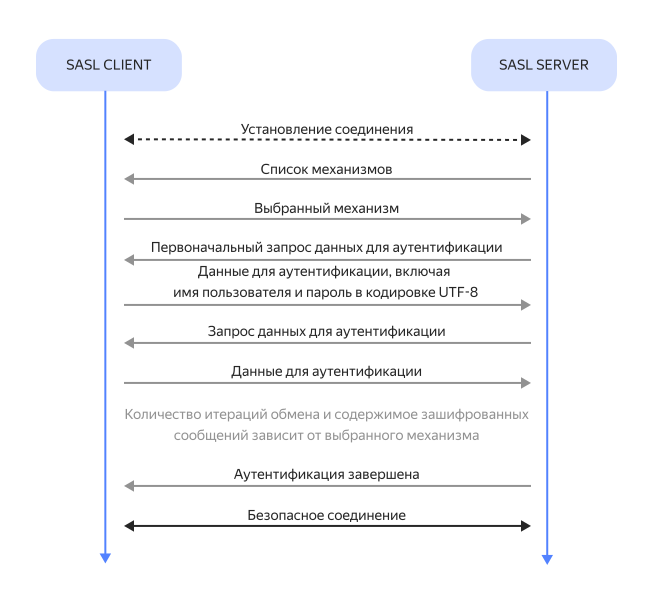

# SASL: фреймворк аутентификации и защиты данных

_SASL_ (Simple Authentication and Security Layer) — фреймворк для аутентификации и обеспечения безопасности, целостности и конфиденциальности при обмене данными между пользователем и приложением. SASL — это не единый протокол, а платформа, которая позволяет сочетать любые поддерживаемые механизмы аутентификации с любыми поддерживаемыми прикладными протоколами.

В информационных технологиях аутентификация означает проверку не только введенных пользователем логина и пароля, но и получаемых от него данных. Например, проверка подлинности электронного письма или контрольной суммы файла, аутентификация по биометрическим данным и так далее.

## История развития SASL {#history}

Первая спецификация SASL (RFC 2222) была написана в 1997 году разработчиком Джоном Гардинером Майерсом. В 2006 Алексеем Мельниковым и Куртом Д. Зейлингом была представлена существенно доработанная версия — RFC 4422. Новая спецификация включала дополнительные способы аутентификации, использование криптографических ключей, обновленный синтаксис и набор параметров.

В 2010 году инженерным советом интернета (IETF) была предложена спецификация [RFC 5801](https://www.rfc-editor.org/rfc/rfc5801.html), которая добавила поддержку разновидностей механизма SCRAM, приватных префиксов и каналов безопасности.

Наиболее актуальной является выпущенная в 2015 году спецификация [RFC 7677](https://www.rfc-editor.org/rfc/rfc7677.html). Она расширяет популярные механизмы обмена данными и детальнее описывает атаки, которым может подвергаться сервер.

## Принцип работы {#how-work}

Аутентификация с помощью SASL происходит в несколько этапов, которые зависят от выбранного механизма и протокола:

1. Сервер передает сообщение со списком поддерживаемых механизмов аутентификации.
1. В ответном сообщении устройство клиента указывает выбранный механизм.
1. Происходит обмен зашифрованными с помощью протоколов сообщениями для аутентификации, которые содержат имя пользователя и пароль в кодировке UTF-8. Детали обмена зависят от выбранного механизма.
1. Аутентификация завершается получением от сервера сообщения об успехе и дополнительных данных, если они требуются.

При возникновении проблем процесс может быть завершен на любом этапе.

## Механизмы и протоколы SASL {#mechanisms-and-protocols}

Механизм аутентификации представляет собой способ, с помощью которого происходит обмен сообщениями между пользователем и сервером. Основные механизмы аутентификации SASL:

* EXTERNAL — аутентификация работает в контексте протоколов с уже определенными технологиями защиты, такими как [TLS](tls.md) и [IPSec](ipsec.md).
* ANONYMOUS — для анонимного гостевого доступа.
* SCRAM — стандартный механизм формата «запрос — ответ».
* GSSAPI — механизм на основе протокола [Kerberos](https://{{ lang }}.wikipedia.org/wiki/Kerberos), основанного на криптографии симметричных ключей.
* OAUTHBEARER — аутентификация проходит с помощью OAuth-токенов 2.0.
* PLAIN — позволяет передавать логин и пароль в открытом виде.
* DIGEST-MD5 — пользователю присваивается уникальный идентификатор, основанный на хэше его пароля и других данных.
* CRAM-MD5 — работает по тому же принципу, что и DIGEST-MD5, но помимо этого предоставляет защиту от атак повторного воспроизведения.

Каждый механизм может работать с различными протоколами передачи данных — интерфейсами, которые обеспечивают их целостность и конфиденциальность. Механизмы аутентификации SASL поддерживают большинство из популярных протоколов, например:

* ACAP (Application Configuration Access Protocol) — позволяет клиенту получить доступ к конфигурационным данным сервера.
* AMQP (Advanced Message Queuing Protocol) — позволяет компонентам системы обмениваться сообщениями.
* BEEP (Blocks Extensible Exchange Protocol) — фреймворк для создания многофункциональных протоколов обмена разными типами сообщений.
* IMAP (Internet Message Access Protocol) — используется для работы с почтовыми серверами.
* IRC (Internet Relay Chat) — позволяет обмениваться сообщениями и файлами в режиме реального времени.
* LDAP (Lightweight Directory Access Protocol) — легковесный протокол для совершения простых операций на сервере.
* EMPP (Extensible Messaging and Presence Protocol или Jabber) — используется в соцсетях для обмена текстом и медиаконтентом.

## Применение SASL в {{ yandex-cloud }} {#yc}

Среди облачных сервисов {{ yandex-cloud }} фреймворк SASL используется в [{{ mkf-full-name }}](/services/managed-kafka/). К кластерам {{ KF }} можно подключиться с использованием шифрования (SASL_SSL) — порт 9091, так и без него (SASL_PLAINTEXT) — порт 9092. Подробнее см. в [документации](../managed-kafka/).

Чтобы безопасно поставлять данные из топиков {{ KF }} в облачные хранилища, воспользуйтесь [руководствами](../data-transfer/tutorials/index.md#delivery-to-queue) сервиса [{{ data-transfer-full-name }}](/services/data-transfer/).

Сервис [{{ mch-full-name }}](/services/managed-clickhouse/) также позволяет использовать SASL для аутентификации в любых кластерах {{ KF }} и [получения данных](../tutorials/dataplatform/fetch-data-from-mkf.md) оттуда. Подробнее см. в [документации](../managed-clickhouse/).
